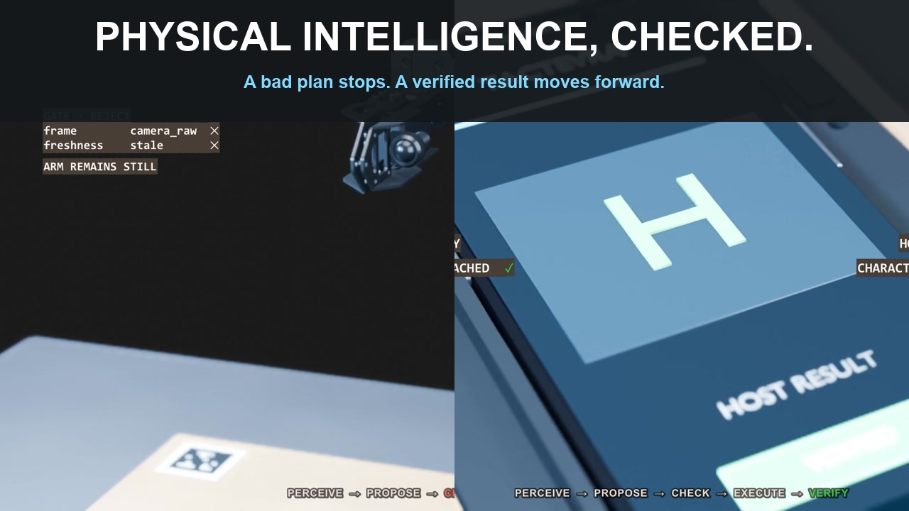

# Tactevra


[](https://github.com/j-webtek/tactevra/actions/workflows/offline-checks.yml)

The CI badge covers [scoped hardware-free checks](docs/CI.md), not physical robot qualification.

**An experimental local-first robotics platform connecting user intent, visual evidence, and checked physical actions.**

[Get started](docs/GETTING_STARTED.md) · [How the system works](docs/SYSTEM_OVERVIEW.md) · [Current capabilities](PROJECT_STATUS.md) · [Roadmap](ROADMAP.md) · [Documentation](docs/README.md) · [Contribute](CONTRIBUTING.md) · [Governance](GOVERNANCE.md)

[Get help](SUPPORT.md) · [Report a vulnerability privately](SECURITY.md)

## See how Tactevra checks a physical action

[](https://j-webtek.github.io/tactevra/)

[▶ Watch the explainer with mobile-friendly controls and selectable English captions](https://j-webtek.github.io/tactevra/)
· [English captions (WebVTT)](assets/media/tactevra-overview.en.vtt)

The narrated film follows “Press the H key” through Tactevra's five-stage
architecture: **perceive, propose, check, execute, and verify**. It shows a bad
proposal being rejected before a valid plan is admitted. The rendered keypress
is explicitly labeled as a simulation; the film presents the current system
design and measured workcell geometry, not autonomous-operation or physical-
qualification evidence.

Formerly **RoCell**. Existing `rocell` commands, package names, and hardware release
paths remain unchanged for compatibility. The canonical source repository is now
`j-webtek/tactevra`; GitHub redirects the former repository URL.

Tactevra is an experimental robotics project with a long-term goal: let you
give an AI a task in plain language and have a robot arm carry out the
keyboard and phone actions on your behalf.

Using a Waveshare RoArm-M3, we are first building reliable physical control:
positioning the arm, pressing keyboard keys, and tapping a phone with a
stylus. This repository contains the control software, simulations, test
records, and printable workcell designs that support that work.

AI and arm software are being developed together. The offline AI pipeline
interprets supported requests and proposes target coordinates. The arm software
checks those proposals before planning movement. A future request to enter text
or navigate a phone app would become a sequence of checked physical actions with
confirmation that the intended input occurred.

Today's movement and feedback tests build the foundation for that future
system. Reliable typing, phone interaction, and AI-directed task execution
are development goals, not completed capabilities.

## Where we are

As of September 27, 2026, you can explore a local rehearsal interface, interpret
supported text requests offline, and inspect simulated coordinate and movement
results. The AI v2 command assembler and arm validation interface have passed a
shared test using synthetic evidence. Supervised noncontact arm movements are
also documented in the lab records.

The repository now also carries a shared model/arm conformance profile and an
operational-readiness gate. A merged precision adapter can now turn pinned pose
output into the same V2 batch consumed by the arm lane while preserving repeated
targets and abstaining on invalid evidence. Its current 14.400834977 mm
synthetic uncertainty bound is too large for ordinary key safe regions, so it is
not deployment-qualified. These are software control boundaries, not permission
to move hardware and not evidence of physical typing.

These are separate research results, not an end-to-end autonomous product.
The project has not demonstrated a camera-to-arm workflow that reliably types
on a physical keyboard or operates a phone. Measured calibration, tool geometry,
final-camera localization, contact behavior, and confirmation of actual device
input remain open. The next high-value test is fixed-camera measured calibration
and held-out localization—not another broad ghost-motion sequence.

Read [project status](PROJECT_STATUS.md) for the checkpoint, evidence, and
next steps. Simulation results, servo feedback, and measured tip accuracy
are tracked separately.

## Start here

| I want to… | Read this |
| --- | --- |
| Try the project for the first time | [Getting started](docs/GETTING_STARTED.md) |
| Understand the end-to-end system | [System overview](docs/SYSTEM_OVERVIEW.md) |
| Understand what works and what comes next | [Project status](PROJECT_STATUS.md) |
| Follow the evidence-based delivery stages | [Roadmap](ROADMAP.md) |
| Set up the code and contribute | [Developer setup](CONTRIBUTING.md) |
| Explore the local interface | [Wizard workbench guide](software/docs/WIZARD_WORKBENCH.md) |
| Build the physical workcell | [Hardware build guide](docs/HARDWARE_BUILD_GUIDE.md) |
| Find architecture, test results, or procedures | [Documentation guide](docs/README.md) |
| Decode project terminology | [Glossary](docs/GLOSSARY.md) |

After completing the [base installation](docs/GETTING_STARTED.md#install-the-software),
you can optionally launch the local rehearsal interface from
the repository root:

```powershell
.\start-rocell-wizard.ps1
```

Rehearsal is the default; launching it does not open hardware connections.
The [workbench guide](software/docs/WIZARD_WORKBENCH.md) covers the available
actions and terminal interface.

## Repository layout

| Folder | Contents |
| --- | --- |
| [software/](software/README.md) | Python runtime, firmware, models, tests, and technical documentation |
| [software/ai/](software/ai/README.md) | Intent parsing, vision research, and the AI-to-arm command interface |
| [active-project/RoCell_v0_3/](active-project/RoCell_v0_3/README_FIRST.md) | Active RC03 hardware design, print files, and assembly instructions |
| [hardware/static_overhead_camera/](hardware/static_overhead_camera/README.md) | Static overhead camera design and mounting work |
| [scripts/](scripts/) | Project tools and experiment runners |
| [docs/](docs/README.md) | Reading guide and historical workspace reference |
| [active-project/RoCell_v0_2/](active-project/RoCell_v0_2/README_FIRST.md) | Frozen earlier hardware release, retained for reference |

RC03 and RC02 parts and coordinates belong to separate releases. Hardware
packages retain their own print-readiness and measurement requirements.

## Working with this project

This is an experimental physical system. Follow the current procedure for
the exact controller and test; a passing simulation or source update does
not establish physical clearance or authorize a deployment.

Credentials, device backups, raw run exports, and local toolchains stay
outside Git. A clone contains the shared development baseline, not the
entire lab workstation. See [contributing](CONTRIBUTING.md) for setup,
verification, and sharing evidence.

Detailed simulation results, command examples, and hardware history formerly
on this page are preserved in the
[historical workspace reference](docs/history/WORKSPACE_REFERENCE.md).

## License

Copyright 2026 Tactevra contributors. Historical copyright and attribution notices
remain unchanged during the Tactevra brand transition.

Original contributions in this repository are licensed under the
[Apache License, Version 2.0](LICENSE).
Third-party code, models, drawings, and other vendor assets retain their
respective licenses and attribution notices; this license does not relicense
those materials. Review the maintained [third-party notices](THIRD_PARTY_NOTICES.md)
and linked provenance records for applicable terms and unresolved clearance.

For repository history and citation metadata, see the [changelog](CHANGELOG.md),
[versioning policy](docs/VERSIONING.md), and [citation file](CITATION.cff).
