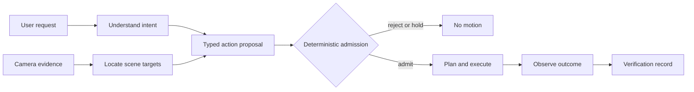

# Tactevra


[](https://github.com/j-webtek/tactevra/actions/workflows/offline-checks.yml)
[](https://github.com/j-webtek/tactevra/actions/workflows/repository-health.yml)
[](LICENSE)

**A governed interface between AI and the physical world.**

Tactevra connects language, visual evidence, and specialized AI models to
checked robot-arm actions. Models describe *what* should happen; deterministic
software decides *whether and how* movement may proceed, records the result,
and keeps unverified proposals away from the motors.

[Get started](docs/GETTING_STARTED.md) ·
[System overview](docs/SYSTEM_OVERVIEW.md) ·
[Project status](PROJECT_STATUS.md) ·
[Documentation](docs/README.md) ·
[Roadmap](ROADMAP.md) ·
[Contribute](CONTRIBUTING.md)

## Why Tactevra

Giving an AI model a physical appendage introduces a boundary that ordinary
software agents do not have: a plausible answer can become real motion.
Tactevra makes that boundary explicit and inspectable.

| Principle | What it means in Tactevra |
| --- | --- |
| **Semantic, not servo-level input** | AI components propose named actions and evidence-bound targets rather than writing raw motor commands. |
| **Deterministic admission** | Runtime checks own calibration, coordinate transforms, freshness, reachability, motion policy, and execution authority. |
| **Observable outcomes** | Proposed, accepted, transmitted, reported, and independently verified states remain distinct. |
| **Fail-closed behavior** | Missing, stale, incompatible, or uncertain evidence blocks progress instead of being silently guessed. |
| **Local-first development** | Core rehearsal, parsing, simulation, and validation paths can be inspected without a cloud control plane. |

The first workcell uses a Waveshare RoArm-M3 to research interaction with tools
designed for people—initially keyboards and phone interfaces. The architecture
is intended to remain useful beyond one arm, model, or device.

## How it works



The system follows five stages:

1. **Perceive** — collect image and system-state evidence.
2. **Propose** — translate intent into typed, coordinate-aware actions.
3. **Check** — validate identity, calibration, freshness, geometry, and policy.
4. **Execute** — convert an admitted plan into bounded controller work.
5. **Verify** — compare the observed result with the requested outcome.

This separation is the core design: model reasoning remains useful without
making model output the final authority over physical movement.

## Explore it today

The repository includes a hardware-free path that demonstrates the software
boundary without moving an arm or downloading a model.

### 1. Install

Windows PowerShell and Python 3.10 or newer are sufficient for this abbreviated
path. See the documented [base installation](docs/GETTING_STARTED.md#install-the-software)
for supported context and verification details.

```powershell
git clone https://github.com/j-webtek/tactevra.git
cd tactevra
python -m venv .venv
.\.venv\Scripts\python -m pip install -e './software'
```

### 2. Interpret a request

```powershell
.\.venv\Scripts\python software/ai/run_offline.py ground --request 'Type "hi" on the keyboard'
```

The output contains an ordered proposal for H followed by I. It is a structured
plan, not a keystroke and not permission to move hardware.

### 3. Preview nominal targets

```powershell
.\.venv\Scripts\python software/ai/run_offline.py coordinate-preview --request 'Type "hi" on the keyboard'
```

This exposes candidate coordinates and the prerequisites still missing before
execution. The preview deliberately produces no controller commands.

For expected results, troubleshooting, and the optional local interface, follow
the complete [getting-started guide](docs/GETTING_STARTED.md).

## Current project surface

| Area | Available in the repository |
| --- | --- |
| Intent | Grounded parsing and deterministic compilation for supported requests |
| Perception | Scene-quality adapters, saved-image workflows, and experimental keyboard localization |
| AI-to-arm boundary | Versioned schemas, proposal validation, freshness checks, and compatibility profiles |
| Motion runtime | Coordinate transforms, IK and route screening, controller-command previews, and lifecycle rehearsal |
| Evidence | Append-only engineering records, identity-bound manifests, and explicit evidence levels |
| Workcell | RC03 printable hardware, assembly resources, and static-camera integration designs |
| Developer operations | Cross-platform tests, repository governance, release gates, and automated health reporting |

For the precise, dated distinction between implemented software, simulation,
controller feedback, physical measurement, and verified device input, use
[project status](PROJECT_STATUS.md). Detailed test counts and workstream stages
belong in the linked evidence records rather than this overview.

## Architecture and workstreams

```text
User / application
        │
        ▼
Tactevra AI ── typed proposal + evidence ──► Tactevra Runtime
                                                   │
                                      admission, planning, execution
                                                   │
                                                   ▼
                                         Tactevra Workcell
                                                   │
                                                   ▼
                                      observation and verification
```

- **Tactevra AI** interprets requests, evaluates scenes, and proposes targets.
- **Tactevra Runtime** owns validation, planning, authority, communication, and
  result records.
- **Tactevra Workcell** combines the arm, camera, tools, fixtures, and measured
  environment.
- **Tactevra Studio** is the local interface for setup, rehearsal, task review,
  and diagnostics.

Shared contracts keep these workstreams compatible without collapsing their
responsibilities. See the [system overview](docs/SYSTEM_OVERVIEW.md) for the
full request-to-result flow and the
[shared AI/arm workplan](software/ai/docs/SHARED_AI_ARM_WORKPLAN.md) for current
integration ownership.

## Watch the architecture

[](https://j-webtek.github.io/tactevra/)

[Watch the narrated explainer](https://j-webtek.github.io/tactevra/) to follow a
request through perceive, propose, check, execute, and verify. The rendered
keypress is labeled as a simulation and illustrates the system design rather
than physical-qualification evidence.

## Choose your path

| If you want to… | Start here |
| --- | --- |
| Run the hardware-free walkthrough | [Getting started](docs/GETTING_STARTED.md) |
| Understand the architecture | [System overview](docs/SYSTEM_OVERVIEW.md) |
| Review current evidence and limitations | [Project status](PROJECT_STATUS.md) |
| Explore the local interface | [Tactevra Studio workbench](software/docs/WIZARD_WORKBENCH.md) |
| Integrate AI output with arm software | [Shared AI/arm workplan](software/ai/docs/SHARED_AI_ARM_WORKPLAN.md) |
| Develop the runtime | [Software reference](software/README.md) |
| Build the workcell | [Hardware build guide](docs/HARDWARE_BUILD_GUIDE.md) |
| Contribute or maintain the repository | [Contributing](CONTRIBUTING.md) · [Repository operations](docs/REPOSITORY_OPERATIONS.md) |
| Find a specific technical document | [Documentation index](docs/README.md) · [Glossary](docs/GLOSSARY.md) |

## Repository map

| Path | Purpose |
| --- | --- |
| [`software/`](software/README.md) | Runtime, interfaces, simulations, firmware sources, and tests |
| [`software/ai/`](software/ai/README.md) | Language, vision, evaluation, and proposal-generation research |
| [`active-project/RoCell_v0_3/`](active-project/RoCell_v0_3/README_FIRST.md) | Current RC03 mechanical design and assembly package |
| [`hardware/static_overhead_camera/`](hardware/static_overhead_camera/README.md) | Fixed-camera structure and integration resources |
| [`docs/`](docs/README.md) | User, architecture, governance, evidence, and operations documentation |
| [`scripts/`](scripts/) | Repository maintenance and development tools |

`rocell` remains the package, command, and historical hardware identifier for
compatibility. New public product language uses **Tactevra**.

## Development and governance

```powershell
.\.venv\Scripts\python -m pip install -e './software[test]'
.\maintain-repository.ps1 verify
```

Changes are reviewed through protected `main`, scoped offline verification,
shared-contract routing, and evidence-retention rules. These controls improve
traceability; they do not themselves qualify a physical setup or authorize a
release. Start with [contributing](CONTRIBUTING.md), then use
[governance](GOVERNANCE.md) and the [roadmap](ROADMAP.md) for decision and
delivery boundaries.

For help, use [support](SUPPORT.md). Report vulnerabilities through the
[private security process](SECURITY.md).

## License and attribution

Original contributions are licensed under the
[Apache License, Version 2.0](LICENSE). Third-party code, models, drawings, and
vendor assets retain their respective terms. Review
[third-party notices](THIRD_PARTY_NOTICES.md) and the linked provenance records
before redistribution.

Copyright 2026 Tactevra contributors. See [CHANGELOG.md](CHANGELOG.md),
[versioning](docs/VERSIONING.md), and [CITATION.cff](CITATION.cff) for project
history and citation metadata.
