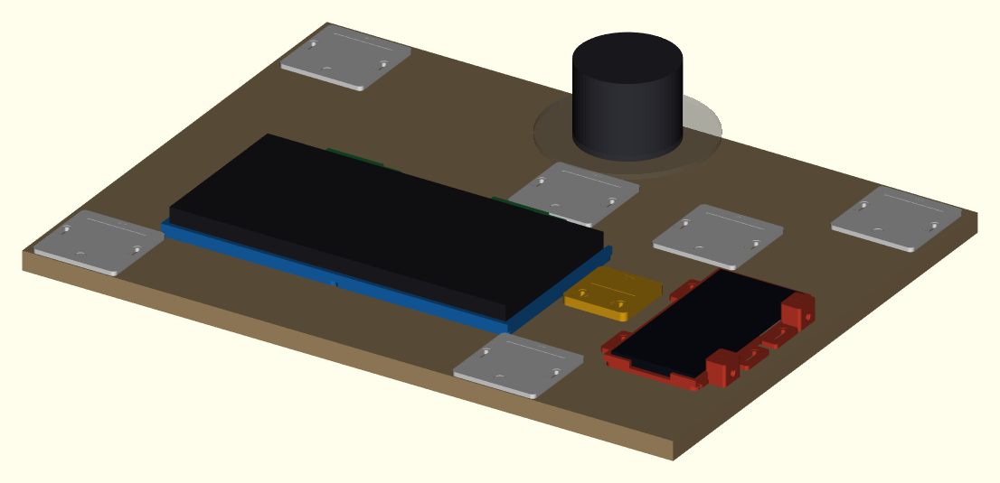
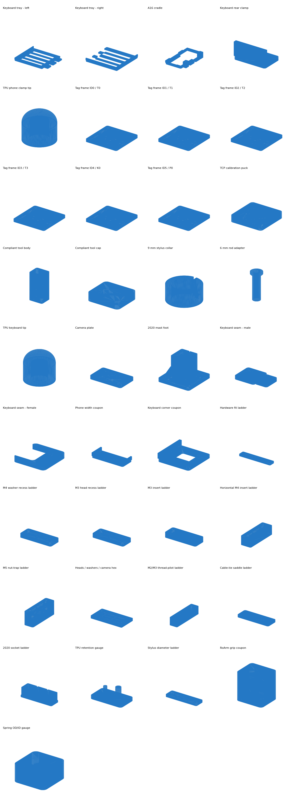
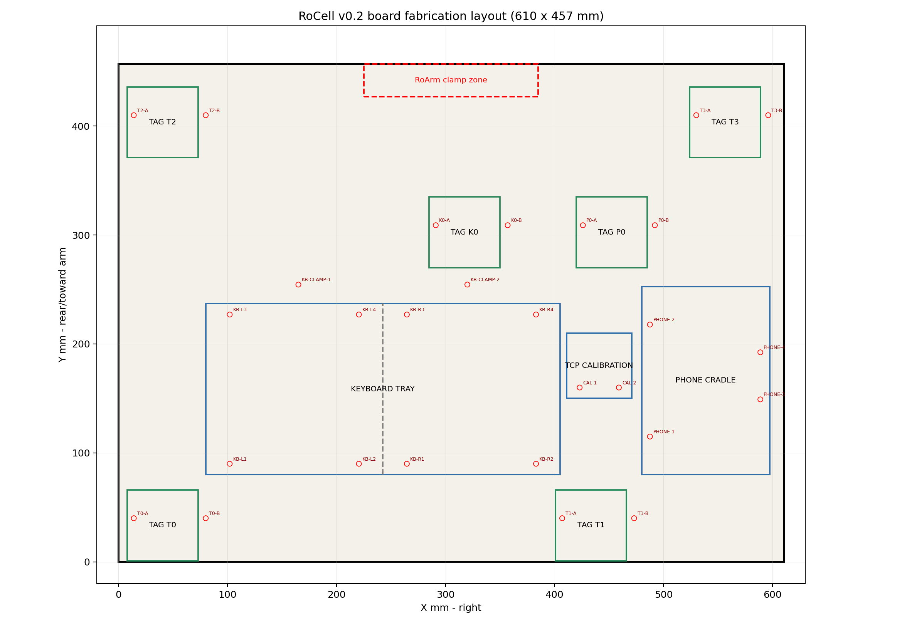
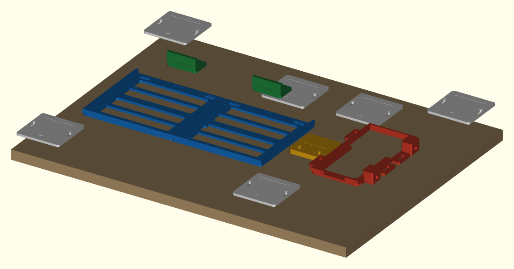

# RoCell v0.2
## Print-ready CAD and explicit assembly manual

| Document field | Value |
|---|---|
| System | Waveshare RoArm-M3 Pro + compact keyboard + Samsung Galaxy A16 5G |
| Structural board | 610 x 457 x 18 mm |
| Target printer | QIDI Plus4, nominal 305 x 305 x 280 mm |
| Conservative packing envelope | 295 x 295 x 280 mm |
| Controlled design revision | RC02-PRO-R1 |
| Revision date | 2026-08-30 |

> **Engineering status:** The STL meshes are watertight and have been dimensionally checked against the target printer envelope. This package has not been physically fitted to your exact printer output, phone case, keyboard sample, or RoArm. Print the fit coupons and perform the staged acceptance tests before allowing the arm to contact the phone or keyboard.



# 1. Design decision: print the fixtures, not the structural board

The structural work surface should be one rigid **610 x 457 x 18 mm plywood panel**. It is larger than the QIDI Plus4 envelope and, more importantly, a multi-panel printed deck would add flex, seam error, and thermal warp to a calibration-sensitive robot cell. The package therefore includes:

- `cad/step/board_610x457x18_drilled.step` for CAD/CNC reference.
- `drawings/board_610x457_drill_layout.dxf` for CNC/router workflows.
- `drawings/board_610x457_drill_layout.svg` for vector editing.
- `drawings/board_drill_template_letter_1to1.pdf` for a normal printer.

Everything that benefits from custom geometry is printed. The A16 cradle is one piece. The keyboard fixture is split into only **two large interlocking halves** because its 325 mm outer width cannot fit the 305 mm Plus4 bed in any flat rotation. The reference file `stl_large_printer_optional/keyboard_tray_full_325mm.stl` requires a genuinely larger-format printer with roughly 335 x 165 mm clear area.

# 2. Fixed design assumptions

The default CAD uses these nominal device envelopes:

| Device | Nominal envelope | Important qualification |
|---|---:|---|
| Samsung Galaxy A16 5G | 164.4 x 77.9 x 7.9 mm | Bare phone. Any case requires measurement and regeneration. |
| Perixx PERIBOARD-409 | 315 x 147 x 21 mm | Manufacturing feet, cable strain relief, and revisions must still be checked. |
| QIDI Plus4 | 305 x 305 x 280 mm nominal | Plate generation uses a conservative 295 x 295 x 280 mm envelope. |

To modify dimensions without editing code:

1. Copy `config/user_overrides.example.json` to `config/user_overrides.json`.
2. Enter total case additions in `phone_case_extra_w`, `phone_case_extra_l`, and `phone_case_extra_t`.
3. Run `python scripts/generate_cad.py`.
4. Re-run `python scripts/generate_drawings.py` if fixture locations or dimensions change.
5. Print the fit coupon again.

# 3. Printed parts and quantities

| Part | Qty | Envelope mm | Material |
|---|---:|---:|---|
| `keyboard_tray_left.stl` | 1 | 184.5 x 157.0 x 11.0 | PETG |
| `keyboard_tray_right.stl` | 1 | 162.5 x 157.0 x 11.0 | PETG |
| `keyboard_rear_clamp.stl` | 2 | 52.0 x 34.0 x 25.0 | PETG |
| `phone_cradle_a16.stl` | 1 | 117.3 x 172.8 x 20.0 | PETG |
| `phone_clamp_tip_TPU_M4.stl` | 4 | 7.5 x 7.5 x 8.0 | TPU 95A |
| `phone_width_fit_test.stl` | 1 | 86.3 x 36.0 x 9.0 | PETG |
| `keyboard_corner_fit_test.stl` | 1 | 58.0 x 58.0 x 11.0 | PETG |
| `keyboard_seam_fit_male.stl` | 1 | 60.0 x 38.0 x 4.0 | PETG |
| `keyboard_seam_fit_female.stl` | 1 | 38.0 x 38.0 x 4.0 | PETG |
| `hardware_fit_gauge.stl` | 3 profile-specific copies | 160.0 x 30.0 x 6.0 | PETG |
| `m4_washer_fit_gauge.stl` | 3 profile-specific copies | 78.0 x 30.0 x 6.0 | PETG |
| `m3_head_fit_gauge.stl` | 1 | 78.0 x 30.0 x 6.0 | PETG |
| `m3_insert_fit_gauge.stl` | 1 | 78.0 x 30.0 x 8.0 | PETG |
| `m4_horizontal_insert_fit_gauge.stl` | 1 | 26.0 x 80.0 x 16.0 | PETG |
| `m5_nut_trap_fit_gauge.stl` | 1 | 26.0 x 90.0 x 30.0 | ASA |
| `setup_hardware_fit_gauge.stl` | 1 | 160.0 x 84.0 x 8.0 | PETG |
| `thread_pilot_fit_gauge.stl` | 1 | 26.0 x 106.0 x 18.0 | PETG |
| `cable_tie_saddle_fit_gauge.stl` | 1 | 84.0 x 30.0 x 7.0 | PETG |
| `mast_socket_fit_test.stl` | 1 | 110.0 x 36.0 x 24.0 | ASA, same lot/profile as mast feet |
| `tpu_tip_retention_gauge.stl` | 1 | 38.0 x 22.0 x 14.0 | PETG |
| `tag_frame_ID0_55mm.stl` ... `tag_frame_ID5_55mm.stl` | 1 each | 78.0 x 78.0 x 4.0 | PETG |
| `calibration_puck.stl` | 1 | 60.0 x 60.0 x 8.0 | PETG |
| `camera_plate_universal.stl` | 1 | 90.0 x 55.0 x 6.0 | PETG |
| `mast_foot_2020.stl` | 2 | 92.0 x 92.0 x 74.0 | ASA preferred/PETG |
| `compliant_tool_body.stl` | 1 | 28.0 x 24.0 x 66.2 | PETG |
| `compliant_tool_top_cap.stl` | 2 (one spare) | 28.0 x 24.0 x 5.0 | PETG |
| `compliant_tool_grip_fit_test.stl` | 1 | 28.0 x 24.0 x 34.0 | PETG |
| `spring_fit_gauge.stl` | 1 | 30.0 x 30.0 x 14.0 | PETG |
| `stylus_collar_9mm.stl` | 2 (one spare) | 13.6 x 13.6 x 5.5 | PETG |
| `rod_bushing_6_to_9mm.stl` | 2 (one spare) | 13.5 x 13.5 x 38.8 | PETG |
| `keyboard_tip_TPU_6mm.stl` | 4 | 12.0 x 12.0 x 14.0 | TPU 95A |
| `stylus_diameter_gauge.stl` | 1 | 92.0 x 28.0 x 4.0 | PETG |

`mast_foot_2020.stl` is optional and intended for a camera stand separate from the main work board. The two tool routes are alternatives: use the 6 mm rod adapter for keyboard presses and the 9 mm collar for a measured commercial capacitive stylus.



# 4. Hardware and materials

Use `BOM.csv` as the complete shopping list. The simplest mounting method is #8 x 5/8 inch pan-head wood screws with M4 washers into 2.5-3.0 mm pilot holes. The CAD and DXF show 4.6 mm through-holes because that is appropriate for an M4 through-bolt/CNC version; **do not drill 4.6 mm holes when using wood screws.**

All slotted M4 board mounts include a shallow 9.2 mm washer track. M5 base holes
and camera-mount slots use 11.0 mm washer seats. These recesses locate and spread
the washer load; they are not permission to omit the washer. Keep the washer
inside the track throughout adjustment.

Minimum non-printed items:

- One 610 x 457 x 18 mm birch plywood or MDF panel.
- Approximately 32 #8 x 5/8 inch pan-head wood screws and washers.
- Two M4 heat-set inserts, 6.0-6.2 mm OD and 5-6 mm long.
- Two M4 x 25 mm thumb/nylon screws for the phone clamp.
- Two M3 heat-set inserts and two M3 x 10 mm screws for the compliant tool cap.
- One light compression spring: OD no more than 13.5 mm, ID at least 10.5 mm, free length 18-22 mm.
- One 6 mm smooth rod, 90-110 mm long, and/or a measured passive capacitive stylus.
- Six adhesive-backed pad pieces, matte tag tape, and two small cable ties for the cradle saddle.
- Camera-specific 1/4-20 hardware, two M5 T-slot fasteners/washers, and straps sized from the measured camera.
- Removable retaining compound for the selected tool adapter; do not substitute an untested permanent adhesive.
- A fixed USB camera and a latching arm-power cutoff outside robot reach.

# 5. Printing plan

Print in this order:

1. Confirm the installed nozzle is 0.4 mm and calibrate the exact PETG spool in QIDI Studio.
2. Print diagnostic jobs `00A` through `00F`, each with its own exact target profile. These separately qualify tray, cradle, precision-tool, adapter, general-hardware, and fine calibration-puck behavior.
3. Measure the actual phone/case and side-feature keepouts, keyboard, RoArm gripper, compliant spring, fasteners, inserts, stylus/rod, and optional extrusion. Record the results in `config/measurement_record.json` with `scripts/record_print_measurement.py`.
4. Run `python scripts/validate_print_readiness.py`.
5. Print only jobs marked **READY** in `PRINT_READINESS.md`, using each plate's matching `.print.json` sidecar.
6. Select the phone-stylus, keyboard-rod, and optional camera-mast routes explicitly; unselected route plates remain **NOT_SELECTED**.
7. Complete the matching generated card in `JOB_CARDS.pdf` and advance the job lifecycle in `config/job_build_record.json`; readiness alone does not mean printed, inspected, kitted, or assembled.

Use the matching `.print.json` sidecar for every job. General QIDI starting points:

| Part class | Material | Layer | Walls | Infill | Support |
|---|---|---:|---:|---:|---|
| Large trays/cradle | PETG | 0.20 mm | 4-5 | 25-30% | Normally none; optional local support in cradle clamp bores |
| Reinforced keyboard trays | PETG | 0.20 mm | 5 | 35% | None; use `petg_tray_structural_0p4` |
| Small rigid precision parts | PETG | 0.12-0.16 mm | 4-5 | 40-100% | None |
| Tag frames | PETG | 0.20 mm | 4 | 25% | None |
| Contact tips | TPU 95A | 0.12-0.16 mm | 3 | 100% | None |
| Optional mast feet | ASA preferred/PETG | 0.24 mm | 6 | 45% | Optional local support at transverse bores |

After printing the phone cradle, run the selected clearance drill through the M4 screw passages by hand. Size the horizontal insert pockets from the matching `H5.9`, `H6.2`, or `H6.5` coupon result. Do not force a hot insert into an undersized tower.

The insert pockets and their matching coupons include the same short tapered
entry. Use it to start the insert squarely, but judge retention from the straight
full-depth pocket. A visibly tilted insert is a failed installation.

The critical ladders are now engraved directly in the STL:

- `hardware_fit_gauge.stl`: clearance rows for M3 (3.2/3.4/3.6), M4 (4.4/4.6/4.8), and M5 (5.3/5.5/5.7). It is intentionally printed under jobs 00A, 00E, and 00F so results remain profile-specific.
- `m4_washer_fit_gauge.stl`: compact 8.8/9.2/9.6 mm M4 washer recesses printed separately under tray job 00A, cradle job 00B, and calibration-puck job 00F. Each copy releases only its own profile.
- `m3_head_fit_gauge.stl`: compact 5.8/6.2/6.6 mm M3 head recesses printed under precision-tool job 00C; the selected head must sit below the surrounding face.
- `m3_insert_fit_gauge.stl`: 4.3, 4.6, and 4.9 mm full-depth M3 insert pockets using the precision-tool profile.
- `m4_horizontal_insert_fit_gauge.stl`: `H5.9`, `H6.2`, and `H6.5` pockets matching the phone tower's horizontal print direction and 6.2 mm depth.
- `m5_nut_trap_fit_gauge.stl`: horizontal production-axis 9.1/9.4/9.7 mm nut traps plus 5.3/5.5/5.7 mm clearances and 10/11/12 mm washer seats.
- `setup_hardware_fit_gauge.stl`: M3 head recesses 5.8/6.2/6.6, M4 washer seats 8.8/9.2/9.6, M5 washer seats 10/11/12, and 1/4-20 camera hex widths 12.6/13.2/13.8 mm. This job-00E result releases general-profile parts only.
- `thread_pilot_fit_gauge.stl`: horizontal M2 pilots 1.5/1.6/1.7 and M3 pilots 2.4/2.5/2.6 mm; it selects a pilot but does not replace thin-adapter pull/cycle testing.
- `cable_tie_saddle_fit_gauge.stl`: 2.6/3.2/4.0 mm saddle slots for the actual cable tie.
- `mast_socket_fit_test.stl`: 20.2/20.5/20.8 mm square sockets with 20 mm engagement.
- `tpu_tip_retention_gauge.stl`: M4 peg on the left and 6 mm rod peg on the right.
- `stylus_diameter_gauge.stl`: 8.0, 8.5, 9.0, 9.5, and 10.0 mm nominal stylus diameters.
- `keyboard_seam_fit_male.stl` and `keyboard_seam_fit_female.stl`: engraved `M` and `F` identifiers.

Retain and label every accepted coupon. If a non-nominal cavity fits best, update `config/user_overrides.json`, regenerate all CAD/plates, and pass `geometry_matches_measurements`; never globally scale a production plate in the slicer. For example:

```text
python scripts/record_print_measurement.py --context operator=Jack --context date=2026-08-30 --context printer_serial=YOUR_SERIAL --context measurement_tool_id=CALIPER_ID --context evidence_directory=qa/RC02-PRO-R1 --context qidi_studio_version=YOUR_VERSION
python scripts/record_print_measurement.py --gate nozzle_0p4_confirmed --status PASS --value installed_nozzle_mm=0.4 --value verification_method=marked_nozzle_or_pin_gauge --evidence-note "Verified before diagnostics"
python scripts/record_print_measurement.py --route keyboard_rod_route --selected yes
python scripts/validate_print_readiness.py
```

## 5.1 Pre-arranged 3MF plates

The `print_plates_3mf/` folder contains modular Plus4 jobs grouped by diagnostic stage, fixture module, tool route, material, and accuracy class. The 295 mm packing limit leaves a nominal 5 mm margin around a centered plate:

| Plate | Contents | Objects | Plate envelope (mm) |
|---|---|---:|---:|
| `00A_PETG_keyboard_profile_fit_tests.3mf` | Keyboard corner, seam, clearances and M4 washer in tray profile | 5 | 174 x 138 |
| `00B_PETG_phone_profile_fit_tests.3mf` | Phone width, horizontal insert, cable saddle and M4 washer | 4 | 216 x 80 |
| `00C_PETG_tool_profile_fit_tests.3mf` | Grip, spring, M3 insert and M3 head in precision profile | 4 | 156 x 70 |
| `00D_PETG_adapter_profile_fit_tests.3mf` | Stylus and thread-pilot adapters | 2 | 128 x 106 |
| `00E_PETG_general_setup_tests.3mf` | General clearances, seats, camera hex and rigid TPU pegs | 3 | 208 x 124 |
| `00F_PETG_calibration_profile_clearance_test.3mf` | M4 clearance and washer in fine puck profile | 2 | 160 x 70 |
| `01_PETG_keyboard_left.3mf` | Reinforced left keyboard-tray half | 1 | 184.5 x 157.0 |
| `02_PETG_keyboard_right.3mf` | Matching right keyboard-tray half | 1 | 162.5 x 157.0 |
| `03A_PETG_phone_cradle.3mf` | Complete phone cradle | 1 | 117.3 x 172.8 |
| `03B_PETG_keyboard_clamps.3mf` | Two keyboard rear clamps | 2 | 112 x 34 |
| `03C1_PETG_tag_frame_first_article.3mf` | ID0 tag-frame first article | 1 | 78 x 78 |
| `03C2_PETG_tag_frames_remaining.3mf` | Unique ID1-ID5 tag frames | 5 | 244 x 161 |
| `03C3_PETG_camera_plate.3mf` | Measured camera plate | 1 | 90 x 55 |
| `03D_PETG_calibration_puck.3mf` | Calibration puck at 0.16 mm | 1 | 60 x 60 |
| `04A_PETG_shared_compliant_tool.3mf` | Shared body, keyed cap and spare cap | 3 | 100 x 24 |
| `04B_PETG_phone_stylus_adapters.3mf` | Two phone-route stylus collars | 2 | 33.6 x 13.6 |
| `04C_PETG_keyboard_rod_adapters.3mf` | Two keyboard-route rod bushings | 2 | 38.5 x 13.5 |
| `05A_TPU_phone_tip_first_article.3mf` | One phone-tip first article | 1 | 7.5 x 7.5 |
| `05B_TPU_phone_tips_and_spares.3mf` | Three additional phone tips | 3 | 47.5 x 7.5 |
| `05C_TPU_keyboard_tip_first_article.3mf` | One keyboard-tip first article | 1 | 12 x 12 |
| `05D_TPU_keyboard_tips_and_spares.3mf` | Three additional keyboard tips | 3 | 52 x 12 |
| `06_ASA_mast_fit_tests.3mf` | ASA 20 mm sockets and horizontal M5 interfaces | 2 | 146 x 90 |
| `07A_ASA_mast_foot_first_article.3mf` | First camera-mast foot for acceptance | 1 | 92 x 92 |
| `07B_ASA_mast_foot_second.3mf` | Second foot after first-article PASS | 1 | 92 x 92 |

Each 3MF has a same-name `.print.json` sidecar containing its exact part quantities, material/process class, walls, layers, infill, supports, purpose, and prerequisite gate IDs. The 3MF itself contains geometry and arrangement, not trusted filament temperatures. Use a calibrated QIDI Studio filament preset for the exact spool.

The generated `PRINT_READINESS.md` and compatibility workbook show **READY**, **WAITING**, or **NOT_SELECTED** for every job. In a fresh package all jobs are intentionally waiting until the nozzle and each exact spool/profile are recorded. Readiness then releases diagnostic jobs 00A-00F before production.

### Larger-printer option

A separate one-piece tray reference is included at `stl_large_printer_optional/keyboard_tray_full_325mm.stl` with editable CAD at `cad/step/large_printer_optional/keyboard_tray_full_325mm.step`. Its envelope is approximately 325 x 157 x 11 mm. It does **not** fit the Plus4 in any flat rotation; a clear area of roughly 335 x 165 mm or larger is recommended.

# 6. Board coordinate system

Place the board in front of you with the arm at the far edge:

- Origin `(0,0,0)` is the **front-left corner of the board top surface**.
- `+X` goes right.
- `+Y` goes rearward toward the arm.
- `+Z` goes upward.
- Suggested factory clamp zone is X=225-385 mm on the rear edge.
- A useful initial arm-base axis is near X=305, Y=420 mm, but the actual base transform must be measured/calibrated.



# 7. Fabricate the structural board

## 7.1 Cut and finish

1. Cut one panel to **610 x 457 x 18 mm**. Check both diagonals; they should match within about 1 mm.
2. Mark the front-left corner and draw arrows for +X and +Y on the underside.
3. Round only the outer corners; do not change the nominal rectangular edges used for measurement.
4. Apply a matte light gray/white finish or matte vinyl. Avoid gloss near markers.
5. Add six rubber feet on the underside, keeping the rear edge clear for the RoArm clamp.

## 7.2 Print and assemble the drill template

1. Open `drawings/board_drill_template_letter_1to1.pdf`.
2. Print all pages at **Actual Size / 100%**. Disable Fit, Shrink, Scale-to-Fit, and borderless scaling.
3. Measure the 100 mm bar on every tile. Reject any tile that is not 100.0 mm within your practical measurement tolerance.
4. Pages A1-A3 are the front row, B1-B3 the middle row, and C1-C3 the rear row.
5. Trim only one side of each overlap. Align duplicated geometry and tape the sheet from the back.
6. Place A1 at the board front-left. Do not mirror the template.
7. Verify the outer board rectangle is 610 x 457 mm before drilling.
8. Center-punch every required hole.
9. For wood screws, drill 2.5-3.0 mm pilots to approximately 12 mm depth. For bolts, drill the specified through-hole.

## 7.3 Hole coordinate fallback

Use this table if a tiled printer introduces uncertainty. Coordinates are from the front-left board origin.

| ID | X mm | Y mm | Use |
|---|---:|---:|---|
| KB-L1 | 102.0 | 103.0 | Keyboard tray slot center |
| KB-L2 | 219.7 | 103.0 | Keyboard tray slot center |
| KB-L3 | 102.0 | 212.4 | Keyboard tray slot center |
| KB-L4 | 219.7 | 212.4 | Keyboard tray slot center |
| KB-R1 | 263.7 | 103.0 | Keyboard tray slot center |
| KB-R2 | 381.4 | 103.0 | Keyboard tray slot center |
| KB-R3 | 263.7 | 212.4 | Keyboard tray slot center |
| KB-R4 | 381.4 | 212.4 | Keyboard tray slot center |
| KB-CLAMP-1 | 165.0 | 253.7 | Rear keyboard clamp |
| KB-CLAMP-2 | 320.0 | 253.7 | Rear keyboard clamp |
| PHONE-1 | 487.5 | 115.0 | Phone cradle board mount |
| PHONE-2 | 487.5 | 217.8 | Phone cradle board mount |
| PHONE-3 | 588.8 | 149.1 | Phone cradle board mount |
| PHONE-4 | 588.8 | 192.3 | Phone cradle board mount |
| CAL-1 | 423.0 | 160.0 | TCP calibration puck |
| CAL-2 | 459.0 | 160.0 | TCP calibration puck |
| T0-A | 19.0 | 40.5 | AprilTag frame |
| T0-B | 62.0 | 40.5 | AprilTag frame |
| T1-A | 548.0 | 40.5 | AprilTag frame |
| T1-B | 591.0 | 40.5 | AprilTag frame |
| T2-A | 19.0 | 416.5 | AprilTag frame |
| T2-B | 62.0 | 416.5 | AprilTag frame |
| T3-A | 548.0 | 416.5 | AprilTag frame |
| T3-B | 591.0 | 416.5 | AprilTag frame |
| K0-A | 361.0 | 302.5 | AprilTag frame |
| K0-B | 404.0 | 302.5 | AprilTag frame |
| P0-A | 491.0 | 302.5 | AprilTag frame |
| P0-B | 534.0 | 302.5 | AprilTag frame |

# 8. Assemble the keyboard fixture



1. Print and mate `keyboard_seam_fit_male.stl` and `keyboard_seam_fit_female.stl`; the keys should insert fully by hand without visible rocking.
2. Identify `keyboard_tray_left.stl`: it has an engraved `L` and three rounded male seam keys on its right edge.
3. Identify `keyboard_tray_right.stl`: it has an engraved `R` and three matching pockets on its left edge.
4. On a flat table, slide the male keys fully into the pockets. Do not glue the seam yet.
5. Put the joined tray at board origin **X=80, Y=80 mm**, front lip toward the board front.
6. Install the eight tray screws through holes `KB-L1..KB-L4` and `KB-R1..KB-R4`. Start all screws loosely.
7. Confirm every M4 washer lies flat inside its recessed track. Push the two tray halves together and square the outside edges. Tighten from the outer corners toward the seam only until the tray cannot move, checking that both support planes remain flush.
8. Place thin EVA/TPU pads in the four shallow pad recesses.
9. Insert the keyboard with its front-left corner firmly against the tray's front and left datums.
10. Place the two rear clamps with their padded vertical faces toward the keyboard. Their nominal board holes are `KB-CLAMP-1` and `KB-CLAMP-2`.
11. Slide each clamp forward until it just contacts the keyboard. Keep its washer in the recessed track; do not bow the keyboard case. Tighten.
12. Remove and reinstall the keyboard ten times. It should return to the same hard datums without rocking.

The tray does not define individual key coordinates. It defines a repeatable keyboard pose. The software key map is calibrated later in keyboard-local coordinates.

# 9. Assemble the Galaxy A16 cradle

## 9.1 Mandatory fit test

1. Print `phone_width_fit_test.stl`.
2. Remove the phone case unless the CAD was regenerated for it.
3. Slide the phone edge into the coupon. It should enter without force and have only small lateral clearance.
4. If it is tight, measure the actual phone/case with calipers, update `user_overrides.json`, and regenerate. Do not sand the full cradle to compensate for a wrong model.

The coupon verifies width and rail height only. Before releasing the full cradle job, measure phone/case length, thickness, camera-bump position, side-button/port keepout intervals, and the USB-C plug envelope. Record both selected clamp-center positions from the phone's bottom edge and require `phone_side_features_measured` to pass. The upper underside has a broad full-width camera-bump relief, but case geometry still varies.

## 9.2 Prepare the integrated clamps

1. Test the actual M4 inserts in `m4_horizontal_insert_fit_gauge.stl`; use the smallest labeled horizontal pocket that installs squarely without splitting or spinning.
2. Print `phone_clamp_tip_TPU_M4.stl` twice. Its flared bore entrance must be open and free of first-layer flash.
3. Install one M4 heat-set insert into each **outer face** of the two right-side clamp towers. Keep each insert square.
4. Let the cradle cool completely. Chase each insert with an M4 screw by hand.
5. Thread an M4 x 25 mm screw from the outside toward the phone cavity.
6. Press one TPU cap onto the inner screw end. Back the screw out until the cap is clear of the phone cavity.
7. The engraved `HAND` marks are a tightening warning: these clamps are never tool-tightened.

## 9.3 Mount and load the cradle

1. Position the one-piece cradle at board origin **X=480, Y=80 mm**.
2. Install four board screws at `PHONE-1..PHONE-4`, leaving them slightly loose.
3. Seat all four washers in their recessed tracks before aligning the cradle.
4. Orient the A16 **screen up**, engraved `USB` end toward the board front, and engraved `TOP` end toward the arm.
5. Lower the phone into the cradle against the fixed left and top datums. The broad opening beneath the upper portion of the phone is camera-bump relief.
6. Confirm neither clamp screw aligns with a side button. The towers are near the corners, but actual case/button geometry must be checked.
7. Tighten both M4 clamp screws by fingertips only until the phone cannot shift. Do not preload the screen or side buttons.
8. Square the cradle to the board layout and tighten its four board screws.
9. Route the measured USB-C cable out the front opening and through the raised right-front cable-tie saddle. Use the tie width selected by job 00B, preserve the recorded bend radius, and confirm the cable/tie does not cover tag T1 or enter the robot sweep.

# 10. Install the AprilTag frames

Print `fiducials/apriltag36h11_ID0-5_40mm_detection_edge.pdf` at Actual Size. **Before cutting**, mark the page-top edge on the back of every 55 mm tile with a pencil arrow. Cut the six tiles and match each one to its unique debossed `tag_frame_ID0_55mm.stl` through `tag_frame_ID5_55mm.stl`. The frame's `+Y` mark and the pencil-marked page-top edge both point toward the rear arm edge. The 55.4 mm artwork pocket is isolated from both washer tracks and includes a thumbnail scoop. Use small pieces of matte double-sided tape; do not cover the tag face with glossy tape.

| Frame name | Printed tag ID | Board frame origin X,Y mm | Frame center X,Y mm | Purpose |
|---|---:|---:|---:|---|
| T0 | 0 | 8, 1 | 47, 40 | Front-left world reference |
| T1 | 1 | 401, 1 | 440, 40 | Front reference kept left of the phone USB lane |
| T2 | 2 | 8, 371 | 47, 410 | Rear-left world reference |
| T3 | 3 | 524, 371 | 563, 410 | Rear-right world reference |
| K0 | 4 | 285, 270 | 324, 309 | Local keyboard-area reference/redundancy |
| P0 | 5 | 420, 270 | 459, 309 | Local phone-area reference/redundancy |

The paper tile is 55 mm, but the pose-estimation size is the **40.0 mm marker detection edge**. Configure software with `0.040` metres and verify the printed size with a ruler/caliper.

# 11. AprilTag, ChArUco, and the calibration puck - different jobs

## 11.1 AprilTag: runtime location labels

An AprilTag is a black-and-white square with a unique numeric identity. The camera detects its four corners and ID. When the software also knows the camera calibration and the physical marker size, it can estimate the tag's 3D pose relative to the camera.

In RoCell, the AprilTags are permanent runtime references. T0-T3 define and continuously re-check the board plane. K0 and P0 put additional visible references close to the device zones. The included set uses the `tag36h11` family to match OpenCV's predefined dictionary and the included helper scripts. Do not mix it with another family in the detector configuration.

AprilTags answer: **Where is the workcell now?**

## 11.2 ChArUco: camera lens calibration

A ChArUco board combines a chessboard's precise interior corners with individually identified ArUco markers. Multiple photographs from varied angles let OpenCV solve the camera's intrinsic matrix and lens distortion. This corrects the fact that image pixels are not an undistorted ruler.

The supplied board is:

- 5 x 7 squares.
- 25.0 mm square length.
- 17.5 mm marker length.
- OpenCV dictionary `DICT_5X5_100`.
- Physical board size 125 x 175 mm.

The ChArUco board is a temporary calibration tool. It is **not** installed in the workcell. Use it again whenever the camera, resolution, focus, zoom, or lens changes.

ChArUco answers: **How does this camera map 3D rays to image pixels?**

## 11.3 Calibration puck: robot tool-center calibration

The yellow printed puck has a crosshair and central divot. The arm approaches the same physical divot from several orientations. Those observations are used to solve the exact offset from the robot's nominal hand frame to the real stylus tip, called the tool center point (TCP).

The puck answers: **Where is the actual tip relative to the robot wrist?**

# 12. Assemble the compliant key/stylus tool

The revised tool positively traps the plunger collar inside a spring chamber. The top cap prevents the plunger from leaving the body.

Before printing the full tool, print job `00C`. Confirm the RoArm grips the engraved `G` coupon without slipping, rocking, bottoming its jaws, or crushing the PETG. Measure the spring, then seat it in `spring_fit_gauge.stl`; it must pass over the 10.0 mm post and inside the 15.2 mm cup without binding. Record all four tool-interface gates before job 04A can become READY.

## 12.1 Prepare the body

1. Print `compliant_tool_body.stl` upright with the specified brim and two `compliant_tool_top_cap.stl` copies flat. Keep slicer seams off both gripper flats and the sliding bore; retain one accepted cap as a labeled spare.
2. Install two M3 heat-set inserts vertically into the two top pockets of the body.
3. Check that the asymmetric locator lets the cap seat flat only in its intended `UP` orientation and that two M3 x 10 mm screws engage without binding.
4. The tapered pocket entries are alignment aids. If an insert starts tilted, reheat and remove it rather than forcing the cap into alignment.
5. Inspect the 10 mm lower guide bore and 15.2 mm upper chamber. Remove strings; do not enlarge the shoulder between them.

## 12.2 Keyboard rod route

1. Cut a smooth 6 mm rod to 90-110 mm and deburr both ends.
2. Press the rod through `rod_bushing_6_to_9mm.stl`. Its tapered flange transition must be smooth and free of droop. Set the flange so the lower tip will protrude approximately 30-40 mm below the tool body at rest. Bond the bushing to the rod only after checking travel.
3. Insert the rod/bushing assembly from the top. The 13.5 mm flange must rest on the chamber shoulder.
4. Put the compression spring around the rod above the flange.
5. Place the top cap with engraved `UP` visible and tighten its two M3 screws alternately until the cap just seats.
6. Push `keyboard_tip_TPU_6mm.stl` onto the rod's lower end.
7. Press the tip upward by hand. Target smooth 3-6 mm travel and full return without sticking. Change the spring if necessary.

## 12.3 Commercial capacitive stylus route

1. Test the stylus by hand on the A16. A plain TPU tip is not a capacitive stylus.
2. Measure the stylus barrel and test it in `stylus_diameter_gauge.stl`.
3. Fit one `stylus_collar_9mm.stl` at a position that leaves 30-40 mm of stylus below the body. The collar must fit inside the 15.2 mm spring chamber. Its radial M2 pilot is only a retention option: select the pilot from job 00D, verify the actual stylus can safely accept point contact, and pass the thin-wall pull/cycle test. Otherwise use a measured interference fit or a tiny removable adhesive drop after final positioning. Retain the second collar as a spare.
4. Insert the stylus/collar from the top, add the spring, and install the cap.
5. Verify smooth travel and electrical touch performance again before the arm holds it.

Clamp the rectangular body in the RoArm gripper using the two shallow side recesses. Use low gripper force; the tool should not rotate but should not be crushed.

# 13. Install and calibrate the camera

A separate rigid camera stand is preferred because arm vibration should not move the reference camera. The optional package includes two 2020 mast feet and one universal camera plate; use metal 2020 brackets for the crossbar. A practical starting geometry is two roughly 700 mm posts, one roughly 650 mm crossbar, and the camera optical center 650-750 mm above the board near X=305, Y=230 mm. Adjust until all six tags and both devices are visible.

The camera plate is marked `CAM` and `MAST`; mount those edges toward the camera
and crossbar respectively. Seat M5 washers in the plate tracks and mast-foot
base recesses. Confirm the 1/4-20 screw cannot bottom in the camera before final
tightening.

Before erecting the stand, print the socket and nut-trap gauges in the final mast-foot material. Select the socket that slides on without rocking and the nut pocket that seats without splitting. Print job 07A first and install its extrusion, nuts, and both transverse bolts. Check base flatness and inspect for cracks immediately and again after 24 hours. Record `mast_foot_first_article_pass`; only then release job 07B. Tighten each foot's bolts evenly so the rear slit closes without cracking the tower.

## 13.1 Intrinsic calibration with ChArUco

1. Print `fiducials/charuco_5x7_square25_marker17_5_1to1.pdf` at Actual Size.
2. Verify the 100 mm bar and 25 mm squares.
3. Mount the sheet perfectly flat to rigid matte card or foam board.
4. Set the camera to the exact resolution used at runtime. Disable digital zoom. Lock focus/exposure if possible.
5. Capture 20-30 sharp images. Move and tilt the board so corners cover the image center, all edges, and all four image corners. Partial views are acceptable when enough ChArUco corners remain visible.
6. Install `requirements-vision.txt`.
7. Run:

```bash
python software_helpers/calibrate_camera_charuco.py \
  --images 'captures/*.png' \
  --definition fiducials/charuco_board_definition.json \
  --output camera_intrinsics.json \
  --preview-dir calibration_previews
```

**8.** Inspect every preview and remove blurred or incorrectly detected frames. Re-run. As an initial engineering target, seek a stable sub-pixel to roughly 1-pixel reprojection error; consistency and downstream physical checks matter more than one number.

## 13.2 Runtime AprilTag check

```bash
python software_helpers/detect_apriltags.py \
  --camera 0 \
  --calibration camera_intrinsics.json \
  --tag-map fiducials/apriltag_map.json \
  --output tag_poses.json \
  --annotated tag_poses.png
```

Confirm IDs 0-5 are correct, tag axes are stable, and the configured tag size is 0.040 m. The four world-tag detection centers are nominally at board coordinates `(40.5,40.5)`, `(569.5,40.5)`, `(40.5,416.5)`, and `(569.5,416.5)` mm. The paper plane is nominally about 3.1 mm above the board top in the recessed frame; measure the assembled height for final calibration.

# 14. Stage the RoArm safely

1. Keep the keyboard and phone out of the cell.
2. Clamp the arm to the accessible rear board edge within X=225-385 mm.
3. Install a physical latching power cutoff outside arm reach.
4. Establish USB serial communication and a conservative park pose.
5. Test stop/power removal before any device contact.
6. Use low speed and acceleration.
7. Teach or command only high-clearance motions above the empty board.
8. Add the keyboard and phone only after the arm can repeatedly return to park without collision.

The model/AI must never own raw motor control. It should request semantic actions such as `press_key`, `type_text`, or `tap_ui`; deterministic software validates geometry, limits, stale perception, and motion.

# 15. Calibration sequence

Perform these calibrations in order and version the resulting files:

1. **Camera intrinsics:** ChArUco -> `camera_intrinsics.json`.
2. **Camera to board:** AprilTags T0-T3 -> camera/world transform.
3. **Robot base to board:** touch or visually align known board points; solve board/robot transform.
4. **Tool center point:** approach the calibration puck divot from several orientations; solve tool offset.
5. **Keyboard plane and key map:** fit the keyboard plane, save each key center in keyboard-local coordinates, and define hover/press/retract distances.
6. **Phone screen plane:** locate the four screen corners, define normalized `(u,v)` coordinates, and map them to the 3D screen plane.
7. **Verification:** use computer text capture and ADB screenshots only to confirm the physical result, not to replace the physical press.

# 16. Initial motion recipes

## Keyboard press

1. Acquire a fresh image and verify tags.
2. Transform the requested key center from keyboard coordinates to board and robot coordinates.
3. Move to 20-30 mm above the key.
4. Re-observe and apply a bounded lateral correction.
5. Descend slowly until 2-4 mm of spring compression is expected.
6. Dwell 80-150 ms.
7. Retract vertically.
8. Verify the character. Stop on a wrong or adjacent key.

## Phone tap

1. Acquire a fresh image and verify the phone-screen plane.
2. Select an interior point of the semantic target; avoid edges.
3. Reject ambiguous or forbidden actions.
4. Hover 15-25 mm above the target.
5. Apply final visual correction.
6. Descend slowly, touch, and retract vertically.
7. Verify the UI state changed. Do not blindly repeat a non-idempotent tap.

# 17. Acceptance tests before AI control

| Stage | Required result |
|---|---|
| Board/template | 100 mm print bars verified; fixture holes agree with coordinate table |
| Keyboard fixture | Ten remove/reinstall cycles without rocking or visible pose change |
| Phone fixture | Ten remove/reinstall cycles; no clamp contacts a side button |
| Camera | All world tags visible; no frame-resolution mismatch; stable calibration |
| Tool | 3-6 mm smooth travel and reliable return |
| Empty-cell motion | 100 park/approach/retract cycles without collision |
| Single key | 100 presses with zero adjacent-key contacts |
| Phone test grid | At least 95% initial accuracy before real apps; target 99% before unattended use |
| Emergency stop | Stops motion/power independently of model or network |
| AI gateway | Raw joint/coordinate commands rejected; semantic action policy enforced |

Do not add the LLM until the keyboard and phone skills pass without an LLM.

# 18. File map

- Full assembly CAD: `cad/step/RoCell_v0_2_full_assembly.step`
- Board CAD: `cad/step/board_610x457x18_drilled.step`
- Printable CAD: `cad/step/*.step` and `stl/*.stl`
- Parametric source: `scripts/generate_cad.py`
- Board drawings: `drawings/`
- Fiducials: `fiducials/`
- Vision starters: `software_helpers/`
- Exact per-model changes and release plan: `PRINT_ENHANCEMENT_PLAN.md`
- Controlled manufacturing travelers: `JOB_CARDS.pdf`, `JOB_CARDS.json`, and `job_cards/`
- Job lifecycle: `BUILD_TRACKER.md` and `config/job_build_record.json`
- Validation: `PART_VALIDATION.csv` and `RELEASE_VALIDATION.json`

# 19. Design references

- Waveshare RoArm-M3 product and documentation: https://www.waveshare.com/roarm-m3.htm and https://www.waveshare.com/wiki/RoArm-M3
- Samsung Galaxy A16 5G dimensions: https://www.samsung.com/sg/smartphones/galaxy-a/galaxy-a16-5g-light-green-128gb-sm-a166plghxsp/
- Perixx PERIBOARD-409 dimensions: https://perixx.com/products/periboard-409
- QIDI Plus4 specifications: https://qidi3d.com/ko/pages/qidi-plus-4-techspecs
- AprilTag project and pose-estimation conventions: https://github.com/AprilRobotics/apriltag
- OpenCV ChArUco calibration documentation: https://docs.opencv.org/4.x/da/d13/tutorial_aruco_calibration.html
