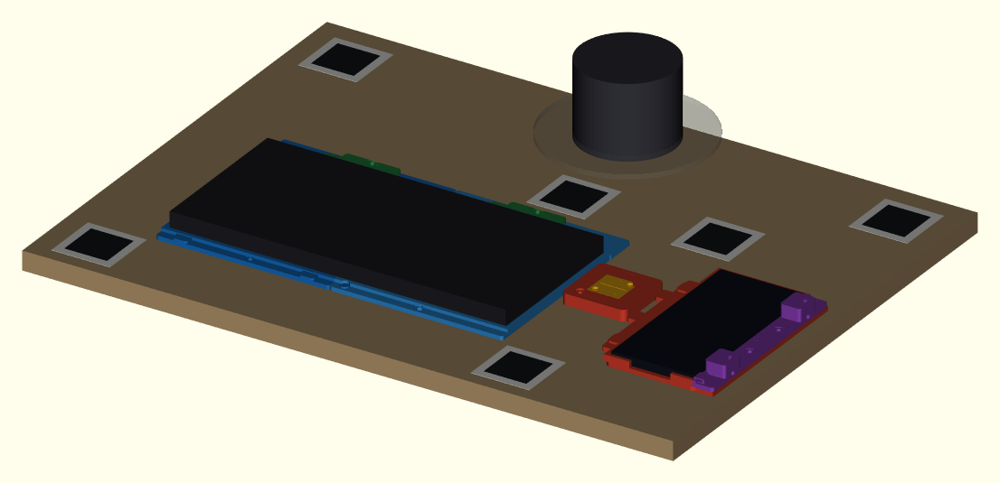

# RoCell v0.3 integrated build manual

## QIDI Plus4 printer-only release

**Execution-sequence note:** this manual groups some engineering detail by subsystem. The operator sequence is controlled by `BUILD_BY_STEP/README.md` and the illustrated guide: reinforce/clamp the arm immediately after board preparation (Step 02), then install the stations, and stop at Step 13 until the intended arm-mounted camera architecture has an exact controlled specification. After that revision, mount and prove the camera using the route-specific procedure. The camera and arm subsections below remain the detailed requirements for those two separate execution steps.

| Control | Value |
|---|---|
| Controlled design revision | `RC03-INT-R1` |
| Printer | QIDI Plus4 |
| Nominal build volume | 305 x 305 x 280 mm |
| Provisional protected envelope | 295 x 295 x 275 mm; physically verify on the actual machine before production printing |
| Structural board | 610 x 457 x 18 mm |
| Board process | Purchased/hand-cut rectangle, sealed, then hand drilled from a 1:1 template |
| Router or CNC | Not required |
| Coordinate datum | Front-left corner of the finished sealed board top surface |

This manual describes the integrated RC03 system. Do not mix RC02 fixtures, tag frames, coordinates, print plates, or assembly instructions into this build.

The files are digitally checked, but the physical build is intentionally **UNRELEASED** until the actual printer, material, hardware, devices, first articles, tag installation, repeatability, and safety gates have recorded PASS evidence. `PRINT_READINESS.md` is the release authority: print only a selected job marked **READY**.

# 1. What RC03 builds

RC03 uses three removable printed stations on one structural board:

1. `keyboard_station_left.stl` is the board-indexed master.
2. `keyboard_station_right.stl` is a seam-indexed slave.
3. `phone_tcp_station.stl` combines the phone nest, cable management, and removable TCP datum receiver.

Four 6 mm steel pins locate the two master stations. Nine M4 interfaces retain the three stations directly against the finished board; the two keyboard rear-clamp screws also serve as the third retainer for their station halves. The right keyboard station has no independent board pins; its master/slave seam owns X, Y, and yaw while its relieved M4 holes only clamp it down. This avoids an overconstrained pin-and-seam loop.

Six AprilTags adhere directly to the cured, finished board. The former permanent printed tag holders and their fasteners are not part of RC03. Wear and adjustment items remain replaceable: two keyboard rear clamps, the phone clamp rail, TPU contact tips, and two keyed TCP cartridges.

The keyboard is supported directly by the board, not by a large printed tray floor. The factory RoArm clamp and a measured metal underside reinforcement remain the structural arm interface; no printed part carries the primary robot load.



# 2. Safety and release discipline

- Install a latching power cutoff/E-stop outside robot reach before powered motion.
- Keep hands, cables, tools, and loose hardware outside the robot envelope.
- Never run robot motion while drilling, installing inserts, or measuring the workcell.
- Keep the phone, keyboard, and stylus out of the cell until empty-cell motion and camera checks pass.
- Use a positive depth stop for all blind locator-pin bores. A locator bore must not break through the 18 mm board.
- Prove every M4 board interface in an 18 mm cutoff before installing it in the finished board.
- Tighten station fasteners to only 0.25-0.35 N m. The pins locate; screws clamp.
- Tighten device clamps by hand only until the pads make stable contact. Do not bow a device shell.
- Never scale, force, silently sand, or ad-hoc drill a released datum to make it fit. Record the failed gate, correct the parameter or process, regenerate, and revalidate.
- QIDI ABS Rapido is the primary rigid material and must use the exact X-Plus 4 filament preset plus the job-specific ABS process. PETG is retained only for the split adapters and inactive fallback camera plate; TPU 95A remains the contact-tip material; ASA remains an inactive mast fallback. PETG, TPU, and ASA temperatures are not released until the exact physical spool is identified and calibrated.

# 3. Package and source-of-truth hierarchy

Use files in this order when two sources appear to disagree:

1. `config/measurement_record.json` for actual measurements and physical release evidence.
2. `config/parameters.json` and `config/workcell_layout.json` for generated dimensions and coordinates.
3. `config/print_jobs.json` and `config/print_profiles.json` for job contents and process controls.
4. `PRINT_READINESS.md` for current release state.
5. The job's `.print.json` sidecar, same-name `.PRINT_SETTINGS.md`, and controlled job card for printing and inspection.
6. This manual for the assembly sequence.

The generated layout is authoritative for all 13 named board features, station origins, protected printer envelope, and all six tag detection centers. Do not transfer coordinates from an older drawing or release.

# 4. Printed parts

## 4.1 Integrated station and setup parts

| Part | Qty | Material / process | Function | Job |
|---|---:|---|---|---|
| `keyboard_station_left.stl` | 1 | QIDI ABS Rapido / `abs_rapido_tray_structural_0p4` | Board-indexed left/master keyboard datum | 01 |
| `keyboard_station_right.stl` | 1 | QIDI ABS Rapido / `abs_rapido_tray_structural_0p4` | Seam-indexed right/slave keyboard datum | 02 |
| `keyboard_rear_clamp.stl` | 2 | QIDI ABS Rapido / `abs_rapido_general_0p4` | Replaceable guided keyboard clamps | 03B |
| `phone_tcp_station.stl` | 1 | QIDI ABS Rapido / `abs_rapido_cradle_0p4` | Phone nest, cable base, and TCP receiver | 03A |
| `phone_clamp_rail.stl` | 1 | QIDI ABS Rapido / `abs_rapido_cradle_0p4` | Replaceable keeper, towers, and captive M4 nuts | 03C1 |
| `tag_application_frame_55mm.stl` | 1 | QIDI ABS Rapido / `abs_rapido_general_0p4` | Reusable direct-tag placement aid; not installed | 03C2 |
| `calibration_puck.stl` | 2 | QIDI ABS Rapido / `abs_rapido_calibration_0p4` | One accepted TCP cartridge and one measured spare | 03D |

## 4.2 Tool-route and optional parts

| Part | Qty | Material / process | Route |
|---|---:|---|---|
| `compliant_tool_body.stl` | 1 | QIDI ABS Rapido / `abs_rapido_precision_0p4` | Shared compliant tool |
| `compliant_tool_top_cap.stl` | 2 | QIDI ABS Rapido / `abs_rapido_precision_0p4` | Installed cap plus spare |
| `stylus_collar_9mm.stl` | 2 | PETG / `petg_adapter_0p4` | Phone stylus route; retained PETG ductility |
| `rod_bushing_6_to_9mm.stl` | 2 | PETG / `petg_adapter_0p4` | Keyboard rod route; retained PETG ductility |
| `phone_clamp_tip_TPU_M4.stl` | 4 | TPU 95A / `tpu95a_0p4` | Two installed phone tips plus two total spares |
| `keyboard_tip_TPU_6mm.stl` | 4 | TPU 95A / `tpu95a_0p4` | Keyboard rod route; two installed plus two total spares |
| `mast_foot_2020.stl` | 1 first article, 1 optional | ASA / `asa_structural_0p4` | Inactive fixed-mast fallback only |
| `camera_plate_universal.stl` | 1 | PETG / `petg_general_0p4` | Inactive fixed-mast fallback only; not an arm-camera adapter (Job 03C3) |

Choose the phone stylus route, keyboard rod route, or both only after their route gates pass. The package does not include a large-printer one-piece keyboard fixture; the two-station architecture is the controlled Plus4 solution.

## 4.3 Diagnostic parts

| Job | Material / process | What it qualifies |
|---|---|---|
| 00A | QIDI ABS Rapido / `abs_rapido_tray_structural_0p4` | Keyboard corner, keyboard/seam locators, clearances, and M4 washer seats |
| 00B | QIDI ABS Rapido / `abs_rapido_cradle_0p4` | Phone fit, service-station locators, vertical M3 inserts, and M4 washer seats; failed legacy nut/tie features are retained only as superseded evidence |
| 03C1 | QIDI ABS Rapido / `abs_rapido_cradle_0p4` | Production-equivalent 7.2 mm captive-nut seats and 5.6 x 2.2 mm wide-tie saddle before Job 03A; final rail seating follows after Job 03A exists |
| 00C | QIDI ABS Rapido / `abs_rapido_precision_0p4` | RoArm grip, spring seat, tool-profile M3 insert, and M3 head recess |
| 00D | PETG / `petg_adapter_0p4` | Phone-stylus-route-only sliding fit in the exact adapter profile |
| 00E | QIDI ABS Rapido / `abs_rapido_general_0p4` | General M3/M4/M5 clearances, screw/washer/camera recesses, and TPU retention |
| 00F | QIDI ABS Rapido / `abs_rapido_calibration_0p4` | Calibration-puck-profile M3 clearance and button-head recess |
| 06 | ASA / `asa_structural_0p4` | Inactive fixed-mast fallback 2020 socket and M5 hardware |

Keep each accepted coupon with its material-lot label and job traveler. A selection from one process profile does not release the same-looking feature in another profile.

# 5. Hardware and materials

Use `BOM.csv` as the complete purchasing authority. Critical items are:

- one 610 x 457 x 18 mm birch plywood board, preferably purchased cut to size;
- four installed 6 x 20 mm precision dowel pins plus spares;
- nine installed M4 board threaded interfaces and flat washers plus spares;
- seven conventional station-retention screws plus three spares;
- two low-profile hand-adjustable keyboard clamp/retention screws plus two spares;
- slow-cure epoxy for the locator pins only after a complete dry fit;
- two top-loaded M4 nuts and two thumb/nylon screws for the phone clamp rail;
- two vertical M3 heat-set inserts and two M3 x 10 screws for the TCP receiver;
- pad material for the two keyboard rear-clamp faces;
- six direct tag tiles plus a full spare set, full-surface matte adhesive, lint-free wipes, and a finish-compatible cleaner;
- a measured precut metal plate at least 3 mm aluminum or 2 mm steel under the factory arm clamp;
- a hand drill, 6 mm brad-point bit, pilot and board-interface bits, positive depth collars, calipers, and a torque-limited hand tool;
- one controlled lot of QIDI ABS Rapido sufficient for the 13 active rigid jobs;
- an exact, recorded PETG spool for jobs 00D, 04B, and 04C when those routes are selected; job 03C3 additionally needs its qualified PETG general process only if the fixed-mast fallback is formally released;
- an exact, dry TPU 95A spool for contact-tip jobs 05A-05D;
- ASA only if a later controlled revision releases the inactive fixed-mast fallback.

Do not choose final station screw length by nominal board thickness alone. Use the actual board, printed station, washer, rear-clamp stack where applicable, and threaded interface in a scrap-board test. Require at least 5 mm useful engagement with no bottoming and no projection beneath the board feet.

Use `FASTENER_MAP.csv` to record the selected screw length, anchor type, and final anchor bore for each named board interface. The effective screw-seat stacks differ: 4.0 mm at fixed keyboard retainers, 8.0 mm through keyboard sliders and the phone rail, and 9.0 mm at `PT-HOLD-TCP` because its washer seats in the modeled 1.5 mm recess below the 10.5 mm island top. One assumed screw length is not automatically valid for all nine positions. Gauge every installed stack and require at least 5.0 mm useful thread engagement with no bottoming or underside projection. After the complete dry fit, record `(Get-FileHash FASTENER_MAP.csv -Algorithm SHA256).Hash.ToLowerInvariant()` in `board_fabrication_pass.selected_fastener_map_sha256`; any later map edit reopens board/fastener acceptance.

# 6. QIDI Plus4 printing workflow

## 6.1 Machine and material setup

1. Confirm the installed nozzle is 0.4 mm and record how it was verified.
2. Clean and inspect the build plate. Keep all released geometry inside the 5 mm physical edge margin.
3. For active rigid jobs, select `QIDI ABS Rapido @Qidi X-Plus 4 0.4 nozzle`: 250 °C first layer, 260 °C thereafter, 90 °C textured bed, 55 °C chamber, 0.95 flow ratio, 0.03 pressure advance, and 24.5 mm³/s maximum volumetric speed. Keep the enclosure sealed and use the exact cooling values in the job record.
4. Dry and calibrate the exact PETG and TPU lots before their retained jobs. Condition ASA only after the fixed-mast fallback is formally released. Do not copy ABS thermal values into PETG, TPU, or ASA.
5. Use the controlled job's `.print.json` and `.PRINT_SETTINGS.md`. Do not infer settings from the 3MF filename or reuse the tray process for another job family.
6. Keep station locator sockets, seam datums, device contacts, captive-nut channels, and cartridge faces away from the slicer seam where practical.
7. Do not auto-orient, merge objects, or apply global XY scaling.

The supplied 3MF files are geometry-and-placement plates. For every non-diagnostic job, import at 100%, inspect the critical layers, save a native QIDI Studio project, close/reopen it, and record its hash and preview evidence under the job-specific round-trip gate.

## 6.2 Adhesion and support controls

- Large ABS keyboard stations: one part per plate, flat as exported, clean textured PEI, and the released 8 mm outer brim with 0.05 mm gap.
- ABS phone/TCP station: one part per plate, flat as exported, the released 8 mm outer brim with 0.05 mm gap, and supports off. Stop for engineering review if the locked preview exposes an unprintable tower; do not silently enable support.
- ABS phone clamp rail: the released 8 mm outer brim; inspect tower roots, horizontal screw passages, and open top-loading nut channels layer by layer.
- ABS TCP cartridges: the released 5 mm outer brim and no ironing over the crosshair or center divot.
- PETG adapter/rod parts: use the released 8 mm outer brim with 0.10 mm gap and confirm the first layer does not close split bores.
- TPU 95A tips: use dry material on a separate plate with the released 3 mm outer brim and 0.10 mm gap.
- ASA mast: enclosed chamber, 10 mm brim, and same-lot diagnostic coupons first.

## 6.3 Controlled print order

1. Run required QIDI ABS Rapido diagnostic jobs 00A, 00B, 00C, 00E, and 00F. Run job 00D only when `phone_stylus_route` is selected; it remains PETG and requires the exact spool preset to be recorded first.
2. Record the selected candidates and update/regenerate geometry when a selected value differs from `config/parameters.json`.
3. Accept job 01, the keyboard left/master first article.
4. Print job 02 and accept the joined keyboard station pair.
5. Print and accept jobs 03A, 03B, 03C1, 03C2, and two 03D cartridges.
6. Print ABS job 04A, the selected PETG adapter route, and its TPU 95A first articles only after each material/profile gate passes.
7. Print fallback camera-plate job 03C3 and mast jobs 06/07 only if `camera_mast_optional` is selected and the machine-enforced `fixed_camera_fallback_architecture_released` gate is PASS after a controlled camera-architecture revision explicitly releases that fallback. Do not print 03C3 as an arm-camera adapter.

Allow every part to cool fully on the bed before dimensional inspection. Never judge locator or seam fit while the part is warm.

# 7. Measure, record, regenerate, and release

Measure the actual keyboard underside and external envelope, phone/case and side features, installed USB cable/bend radius, pins, nuts, screws, washers, M3 inserts, board, arm clamp, camera interface, gripper, spring, rod/stylus, and TPU retention samples.

Initialize the record context before gate entry:

```text
python scripts/record_print_measurement.py --context operator=YOUR_NAME --context date=YYYY-MM-DD --context printer_serial=YOUR_SERIAL --context measurement_tool_id=CALIPER_ID --context evidence_directory=qa/RC03-INT-R1 --context qidi_studio_version=YOUR_VERSION
```

Record objective values, photographs, and evidence paths; do not change a gate to PASS from memory. After measured overrides or coupon selections change, regenerate from the RC03 directory:

```text
python scripts/generate_cad.py
python scripts/generate_fiducials.py
python scripts/generate_drawings.py
python scripts/sync_documentation.py
python scripts/build_print_plates.py
python scripts/generate_prehardware_readiness.py
python scripts/validate_print_readiness.py
python scripts/generate_build_tracker.py
python scripts/generate_job_cards.py
python scripts/render_previews.py
python scripts/build_manual_pdf.py
python scripts/build_manual_pdf.py --source JOB_CARDS.md --output JOB_CARDS.pdf --running-title "RoCell RC03-INT-R1 - Job Cards"
python scripts/validate_release_package.py
python scripts/sync_documentation.py --check
python scripts/update_checksums.py
```

`geometry_matches_measurements` may pass only when every PASS coupon selection that controls geometry matches the generated parameters for this exact revision.

# 8. Fabricate the structural board without a router or CNC

## 8.1 Prepare and qualify the blank

1. Purchase the board as a 610 x 457 x 18 mm rectangle when possible.
2. Lightly ease sharp edges by hand without changing the controlled top face.
3. Apply the same matte sealing schedule to both faces and all edges. Allow full cure.
4. Mark the front-left datum corner, +X/right, and +Y/rear.
5. Measure local flatness over each 300 mm station area and overall board bow.

Acceptance before drilling:

- local gap no greater than 0.50 mm across any 300 mm station area;
- overall bow no greater than 1.5 mm;
- no uncured, glossy, soft, or contaminated tag/station regions;
- actual thickness leaves safe margin beneath the 15 mm locator bores.

## 8.2 Print and register the 1:1 setup template

1. Use the guide selected and hash-recorded in Step 00: `output/pdf/RC03_BOARD_DRILL_GUIDE_LETTER_1TO1.pdf` or `output/pdf/RC03_BOARD_DRILL_GUIDE_24X36_FULL_SIZE_1TO1.pdf`. Do not mix the routes.
2. For the Letter guide, pages 1-3 are overview/schedule/tile-map reference pages marked not for drilling. Print only pages 4-12 as the nine 1:1 tiles, one-sided at **Actual Size / 100%**.
3. Assemble Letter pages 4-12 in the printed 3 x 3 map. Overlap every adjoining pair by the printed **12 mm** zones and align the duplicated registration crosses and matching IDs; never butt paper edges or printer margins.
4. For the 24 x 36 inch alternative, print its single full-size page at **Actual Size / 100%** without tiling, cropping, or combining it with Letter pages.
5. Verify both independent 100 mm scale bars with a reliable steel rule. Reject and reprint if either is outside 100.0 +/- 0.2 mm. Recheck every Letter seam/ID or the full-size board-edge and orientation controls.
6. Register the accepted guide to the front and left board edges, verify FRONT/+X/+Y, independently check several named centers against the coordinate table, and secure the paper without stretching or wrinkling it.

Blue double-ring symbols are the four locator-bore centers. Orange dashed-square symbols are the nine anchor centers only; their final wood-bore sizes come from the completed `FASTENER_MAP.csv`. Green/cyan direct-tag geometry is placement guidance marked NO DRILL.

### Board blank acceptance before layout

Do not register a drill guide to a nominally sized blank without measuring it. Accept the board only when all of these limits pass:

- front and rear width: 610.0 +/- 0.5 mm each, with no more than 0.50 mm difference;
- left and right depth: 457.0 +/- 0.5 mm each, with no more than 0.50 mm difference;
- thickness at every named locator: 17.50-18.50 mm;
- each corner-to-corner diagonal: within 1.00 mm of `sqrt(mean width^2 + mean depth^2)`;
- diagonal-to-diagonal difference: no more than 1.00 mm;
- local flatness: no more than 0.50 mm over any 300 mm station span;
- overall bow: no more than 1.50 mm.

Record the actual values. A failure means STOP for replacement or controlled engineering disposition; do not stretch the paper guide or shift individual marks to compensate.

## 8.3 Named board features

<!-- BEGIN AUTO-GENERATED: RC03_BOARD_FEATURES -->
Coordinates are measured from the front-left corner of the **finished sealed board top**. The named rows below come directly from `config/workcell_layout.json`; do not transfer coordinates from an earlier release.

| ID | Station | Feature | X mm | Y mm | Diameter mm | Depth mm | Instruction |
|---|---|---|---:|---:|---:|---:|---|
| KBL-LOC-ROUND | keyboard_left | locator pin blind | 102 | 78 | 6 | 15 | 6 mm blind bore, 15 mm deep; epoxy 6x20 dowel with 5 mm projection |
| KBL-LOC-RADIAL | keyboard_left | locator pin blind | 220.5 | 78 | 6 | 15 | 6 mm blind bore, 15 mm deep; station socket relieves X axis |
| KBL-HOLD-F | keyboard_left | m4 retention through | 165 | 78 | 4.6 | - | M4 through retention; washer/hand knob above, threaded anchor below |
| KBL-HOLD-R | keyboard_left | m4 retention through | 102 | 246 | 4.6 | - | M4 through retention; washer/hand knob above, threaded anchor below |
| KBL-CLAMP | keyboard_left | m4 retention through | 165 | 254.5 | 4.6 | - | Shared station retention and adjustable rear-clamp hand knob |
| KBR-HOLD-F | keyboard_right | m4 retention through | 323.75 | 78 | 4.6 | - | M4 through retention; 5.6 mm station relief, seam owns XY/yaw |
| KBR-HOLD-R | keyboard_right | m4 retention through | 383 | 246 | 4.6 | - | M4 through retention; 5.6 mm station relief, seam owns XY/yaw |
| KBR-CLAMP | keyboard_right | m4 retention through | 320 | 254.5 | 4.6 | - | Shared slave-station retention and adjustable rear-clamp hand knob |
| PT-LOC-ROUND | phone_tcp | locator pin blind | 487.5 | 115 | 6 | 15 | 6 mm blind bore, 15 mm deep; epoxy 6x20 dowel with 5 mm projection |
| PT-LOC-RADIAL | phone_tcp | locator pin blind | 487.5 | 217.8 | 6 | 15 | 6 mm blind bore, 15 mm deep; station socket relieves Y axis |
| PT-HOLD-TCP | phone_tcp | m4 retention through | 423 | 160 | 4.6 | - | M4 through retention at TCP island |
| PT-HOLD-R1 | phone_tcp | m4 retention through | 588.8 | 149.12 | 4.6 | - | M4 through retention clamps service rail and station to board |
| PT-HOLD-R2 | phone_tcp | m4 retention through | 588.8 | 192.32 | 4.6 | - | M4 through retention clamps service rail and station to board |

On the 1:1 board drill guide, blue double-ring symbols are the four 6.0 mm x 15.0 mm blind locator-bore centers. Orange dashed-square symbols are the nine anchor centers only; select each final wood-bore size from the completed `FASTENER_MAP.csv`. Green and cyan AprilTag geometry is placement guidance marked NO DRILL.
<!-- END AUTO-GENERATED: RC03_BOARD_FEATURES -->

## 8.4 Drill and install the interfaces

1. Transfer all 13 named centers with a sharp awl or small pilot through a printed guide.
2. Remove the paper before final drilling so fibers cannot wind around the bit.
3. At each named locator, record local board thickness, then drill the 6 mm bore square to 15.00 +/- 0.20 mm while preserving at least 2.00 mm of local board floor. Use a brad-point bit and positive depth stop.
4. Prepare the nine M4 threaded interfaces using the exact method proven in the 18 mm scrap-board stack.
5. Deburr by hand and remove all dust. Do not enlarge a locator bore to hide a positioning error.
6. Dry-fit pins, stations, keyboard rear clamps, phone rail, screws, and washers without epoxy or station shims. The modeled station undersides seat directly on the finished board.
7. Start all nine interfaces by hand. The two keyboard clamp screws pass through their sliders and stations; the two phone-rail-side screws pass through the rail and station.
8. Prove three assembly/removal cycles, thread engagement, continuous base contact, and no bottoming or underside projection.
9. Axially proof each board interface at 50 N for 60 seconds. Reject rotation, pullout, or veneer damage.
10. Only after the complete dry fit passes, remove the stations and epoxy the four pins at 5.00 +/- 0.15 mm exposed projection. Record thickness, bore depth, and cured projection by locator ID. Keep epoxy out of the printed sockets.

# 9. Assemble and accept the keyboard station

## 9.1 Left/master first article

1. Inspect `keyboard_station_left.stl` for one watertight body, readable `RC03-L MASTER` marking, clean locator entries, open M4 passages, flat seats, and intact seam posts.
2. Verify free-state corner lift is no greater than 0.75 mm and the support/datum plane is within 0.40 mm.
3. Cycle the exact pins through the job 00A locator coupon at least 20 times before trying the station.
4. Seat the station on its round socket and X-relieving radial slot without screws. It must drop by hand without rocking, cracking, or whitening.
5. Fit the padded rear-clamp slider over its guide tracks and park it rearward.
6. Start the two fixed M4 screws and washers, then start the third low-profile screw and washer through the slider slot and station into `KBL-CLAMP`.
7. After all three threads are engaged and the station is fully seated, tighten gradually to 0.25-0.35 N m.
8. Confirm a 0.10 mm feeler cannot enter beneath the retained base-contact zones.

## 9.2 Right/slave and seam

1. Inspect `keyboard_station_right.stl` for clean round/radial seam sockets and deliberately relieved M4 hold-down holes.
2. Engage the right station with the left station's front round post and rear Y-relieving slot. Do not install board locator pins under the right station.
3. Fit the padded rear-clamp slider over its guide tracks and park it rearward.
4. Start the two fixed right-station screws loosely, then start the third low-profile screw through the slider slot and station into `KBR-CLAMP`.
5. Seat the seam fully, then tighten all three gradually to 0.25-0.35 N m.
6. Require an installed seam gap no greater than 0.40 mm and flush mismatch no greater than 0.25 mm.
7. Verify the combined keyboard datum plane is within 0.40 mm and neither station rocks.

## 9.3 Keyboard loading and clamp adjustment

1. Before mounting either slider in sections 9.1-9.2, install one 0.8-1.0 mm replaceable face pad in its recess; at this stage confirm both preinstalled pads are secure and face the keyboard.
2. Clean the finished board beneath the keyboard. The keyboard's own feet rest directly on the board; current CAD uses no added support pads.
3. Load the keyboard against the front and side datums.
4. Loosen each shared clamp/retention screw only enough for its guided slider to move. Slide the clamp forward until its face pad just touches the keyboard, then retighten to hold that position. Do not use the screw as a yaw guide and do not preload or bow the keyboard shell.
5. Complete ten load/unload cycles. Require no case bow, key interference, rocking, face-pad migration, or station shift.

# 10. Assemble and accept the phone/TCP service station

## 10.1 Bench preassembly

1. Inspect the service station for clean locator sockets, three M4 passages, continuous flat board-contact regions, phone datums, USB/cable path, TCP island, keyed receiver, and vertical M3 insert pockets.
2. Require free-state corner lift no greater than 0.75 mm, phone support-plane error no greater than 0.30 mm, and TCP receiver-seat error no greater than 0.15 mm.
3. With the station off the wood board, use job 00B to select and install the two vertical M3 heat-set inserts. Use low axial pressure, stop at the controlled depth, and cool fully without screws installed. Reject tilt, spin, wall bulge, or incorrect height.
4. Inspect the rail's tower roots, molded-key pockets, hold-down passages, cable saddle, horizontal screw passages, and open top-loading M4 nut channels.
5. On the loose Job 03C1 rail, top-load both standard M4 nuts into the redesigned 7.2 mm lower-half hex seats. Each screw must catch and advance at least three full turns without lifting the nut, and neither nut may spin through 20 advance/back-out cycles. Do not use heat-set inserts or glue in this rail.
6. Feed the project-standard nominal 4.8 mm tie around the actual USB cable through the 5.6 x 2.2 mm saddle; require free feed, useful cinching range, cable clearance, and no cracking.

## 10.2 Mount the station and shared rail

1. Seat the station on its two pins without screws. It must install and release by hand without rocking or whitening.
2. Seat the loaded rail on the station's two molded keys. The keys react phone-clamp side load.
3. Start the TCP-side screw and both shared rail/station screws before tightening any of them.
4. Tighten all three gradually to 0.25-0.35 N m.
5. Confirm a 0.10 mm feeler cannot enter beneath the retained base-contact zones.
6. Install the two hand-adjustable horizontal M4 screws from the outside and fit accepted TPU tips to their inner ends.

## 10.3 TCP cartridge, phone, and cable

1. Measure both job 03D cartridges after cooling. Install the accepted cartridge with the clipped corner aligned to the keyed pocket.
2. Install only the cartridge identified as `installed_cartridge_id` by the Job 03D acceptance record. Tighten two M3 x 10 screws evenly without distorting the datum face. Keep the other accepted cartridge protected and labeled `SPARE - TCP RECALIBRATION REQUIRED`; never substitute it without rerunning TCP calibration.
3. Require cartridge lateral play no greater than 0.15 mm and mounted-height range no greater than 0.10 mm across ten cycles.
4. Place the phone in the exact measured case state against the fixed datums. Confirm camera, button, connector, and screen keepouts before tightening.
5. Advance each horizontal screw by hand only until its TPU tip makes stable contact. Confirm neither screw can actuate a side button.
6. Route the USB cable along the open front path and through the coupon-qualified saddle on the replaceable rail with a relaxed bend. The tie provides strain relief, not crushing force.
7. Complete ten phone load/unload cycles. Require no button actuation, camera contact, cable damage, rail lift, nut spin, or station shift.

# 11. Install the arm and camera

## 11.1 RoArm interface

1. Measure and record the factory clamp footprint and board contact region.
2. Obtain a precut reinforcement plate at least 3 mm aluminum or 2 mm steel that spreads the clamp load beneath the board without conflicting with feet or station hardware.
3. Align the arm to the generated centerline/witness. Keep the factory clamp as the load-bearing interface.
4. Tighten the factory clamp per its instructions and verify the board remains within flatness limits.
5. Install and function-test the latching power cutoff/E-stop before powered robot setup.
6. While de-energized, do not force or back-drive any joint. Use CAD and static visual clearance checks here; powered envelope sampling occurs only during final empty-cell commissioning under the approved controller, limits, E-stop, and program.
7. Do not add printed hard arm stops until the actual clamp geometry has a separately measured and physically qualified design.

## 11.2 Camera

**Architecture hold:** the user intends the operational camera to be mounted on the robot arm, but the exact arm-camera specification and mount are not present in this RC03 package. The current Step 13, universal plate, paired-2020 route, six-tag acceptance set, and camera-to-board workflow describe the previously controlled fixed overhead eye-to-hand fallback. Do not adapt those instructions to the arm by assumption. The `fixed_camera_fallback_architecture_released` gate hard-blocks jobs 03C3, 06, 07A, and 07B while this hold remains open. Resolve `config/camera_architecture_decision.json` through a controlled revision that adds the exact camera/link/frame, mount geometry, mass and center of mass, moving-cable route, eye-in-hand calibration, pose-dependent visibility, timing, payload, reach, and collision evidence.

For any later released camera route, mount the exact accepted camera rigidly, prevent fastener bottoming, provide measured strain relief and full-motion cable service, lock its controllable imaging settings, and prove the route-specific visibility and calibration requirements across every accepted operating pose. A degraded or unknown camera transform never permits contact motion.

# 12. Apply the direct-board AprilTags

<!-- BEGIN AUTO-GENERATED: RC03_DIRECT_TAG_INSTALLATION -->
All six AprilTags attach **directly to the fully cured, finished board**. RC02 printed tag frames and their twelve mounting holes are obsolete. Print `fiducials/apriltag36h11_ID0-5_40mm_detection_edge.pdf` at Actual Size, verify the 100 mm bar and a 40.0 mm detection edge, then cut each 55.0 mm tile square.

Re-register the scale-verified 1:1 board template after all drilling, proof loading, arm clamping, and final board-flatness checks. Transfer each tag center and its +Y/page-top edge witness to the finished board with a fine pencil, then remove the paper and clean the six board regions. Never adhere a tag to or through the paper template.

Align job 03C2's application frame to the transferred center/edge witnesses, with `+Y / REAR` toward board rear. Confirm the actual square 55 mm tile drops into and releases from the square opening without corner contact. Apply one controlled thin layer of matte full-surface adhesive and burnish through clean release paper with a flat block. Lift the frame vertically. Reject bubbles, lifted corners, skew, gloss over the marker, or adhesive extending beyond the paper.

| Name | Printed ID | Role | 55 mm tile origin X,Y mm | Detection center X,Y mm | Yaw |
|---|---:|---|---:|---:|---:|
| T0 | 0 | world | 19.5, 12.5 | 47, 40 | 0° |
| T1 | 1 | world | 412.5, 12.5 | 440, 40 | 0° |
| T2 | 2 | world | 19.5, 382.5 | 47, 410 | 0° |
| T3 | 3 | world | 535.5, 382.5 | 563, 410 | 0° |
| K0 | 4 | station check | 296.5, 281.5 | 324, 309 | 0° |
| P0 | 5 | station check | 431.5, 281.5 | 459, 309 | 0° |

No nominal optical Z is asserted: the installed tag plane depends on the compressed tape and actual stock. Measure every installed detection center and plane relative to the finished sealed board top, then record exact X, Y, Z and yaw under `tag_plane_placement_measured`. The runtime map remains nominal and board-pose solving remains blocked until that gate is PASS. After it is PASS, run `python scripts/generate_fiducials.py --map-only` from the project root and require the summary to report `coordinate_source` as `measured_installation` and `direct_tags` as 6 before handing the map to Step 13.
<!-- END AUTO-GENERATED: RC03_DIRECT_TAG_INSTALLATION -->

Direct-tag acceptance is:

- tile size 55.0 +/- 0.2 mm;
- detection edge 40.0 +/- 0.2 mm;
- measured center placement error no greater than 0.50 mm;
- yaw error no greater than 0.30 degrees;
- edge lift no greater than 0.20 mm;
- 20 detections in 20 static frames for each ID;
- reprojection error no greater than 1.0 pixel.

Record X, Y, optical-plane Z, and yaw for every tag. Board Z=0 is the finished sealed board top surface. Optical Z is the actual compressed adhesive plus tag-stock stack, not a nominal printed-holder height.

# 13. Camera calibration and runtime tag use

## 13.1 ChArUco calibrates the lens

Print `fiducials/charuco_5x7_square25_marker17_5_1to1.pdf` at Actual Size on matte stock and verify its 25.0 mm squares and 17.5 mm markers against `fiducials/charuco_board_definition.json`. Capture 25-40 sharp views across the complete image area, including tilted and edge views. Lock focus, exposure, resolution, and camera mounting before calibration and runtime operation.

Run the camera helper and review its reprojection result:

```text
python software_helpers/calibrate_camera_charuco.py --images "calibration_images/*.png" --definition fiducials/charuco_board_definition.json --output camera_calibration.json
```

ChArUco calibrates camera intrinsics and distortion. It does not define board or fixture coordinates.

## 13.2 AprilTags locate the board

T0-T3 are the primary world tags. K0 and P0 are held-out residual checks near the keyboard and phone regions; they must not be allowed to hide a poor primary board transform.

<!-- BEGIN AUTO-GENERATED: RC03_RUNTIME_TAG_COORDINATES -->
Confirm IDs 0-5, stable axes, matte flat tiles, and a configured 0.040 m detection edge. The frozen nominal T0-T3 detection centers are `(47,40)`, `(440,40)`, `(47,410)`, `(563,410)` mm. T0-T3 define the primary board transform; K0/P0 are held out as station-area residual checks. Current map coordinate source: **nominal_layout**; placement gate: **NOT_TESTED**. The generated runtime map is nominal only and contains no asserted optical Z. `detect_apriltags.py` will report camera-frame tag poses but will not solve a board transform until the placement gate passes.
<!-- END AUTO-GENERATED: RC03_RUNTIME_TAG_COORDINATES -->

Example runtime command:

```text
python software_helpers/detect_apriltags.py --image "acceptance/fov_0001.png" --calibration camera_calibration.json --tag-map fiducials/apriltag_map.json --output "acceptance/reports/fov_0001.json" --annotated "acceptance/annotated/fov_0001.png" --min-world-tags 4 --require-board-pose --require-tag T0 --require-tag T1 --require-tag T2 --require-tag T3 --require-tag K0 --require-tag P0
```

The detector reads tag size from `fiducials/apriltag_map.json`; do not supply a separate tag-size argument. It creates the output directories, writes the JSON report and annotated image, and returns nonzero when the required board pose or any required tag is missing. Use Step 13's non-overwriting batch command for the complete 20-pose acceptance set.

The detector will not solve a board transform from a nominal/null-Z map. Complete and PASS `tag_plane_placement_measured`, run `python scripts/generate_fiducials.py --map-only`, require `coordinate_source: measured_installation`, and then re-run validation.

# 14. Assemble the compliant tool

## 14.1 Shared body

1. Qualify the actual RoArm gripper interface, spring OD/ID/length, vertical M3 inserts, and cap screw heads with job 00C.
2. Install the M3 inserts squarely and let them cool.
3. Fit the spring and verify 3-6 mm smooth compliant travel without coil bind or rubbing.
4. Fit the keyed cap and M3 screws. Do not force a mismatched head into the recess.
5. Prove return-to-center behavior and functional axial force before fitting a device-contact route.

## 14.2 Keyboard rod route

Deburr the actual 6 mm rod, measure it, fit the selected printed bushing, and install the accepted TPU tip. Use dry/interference fit first. If additional retention is required, use only a recorded plastics-compatible removable compound and prove pull-off/cycle performance on a spare adapter before robot use.

## 14.3 Phone stylus route

Confirm the passive stylus works by hand on the Galaxy A16 in its final case state. Select the smallest freely sliding job 00D collar, then qualify the final dry/interference fit. The obsolete thin-wall radial screw/pilot route is not part of RC03. Use only a recorded plastics-compatible removable retention compound if the proven dry fit is insufficient.

# 15. Station repeatability and structural proof

After all interfaces are installed:

1. Remove and reinstall the left/master keyboard station ten times.
2. Remove/rejoin/reinstall the right/slave station ten times with the master fixed.
3. Remove and reinstall the phone/TCP station ten times.
4. Record X, Y, Z, and yaw each cycle using the defined datums.
5. Apply a 20 N lateral load to each station and a 10 N load at each functional point.

Acceptance per station:

- peak-to-peak X range no greater than 0.25 mm;
- peak-to-peak Y range no greater than 0.25 mm;
- peak-to-peak yaw no greater than 0.20 degrees;
- peak-to-peak Z range no greater than 0.20 mm;
- no 0.10 mm feeler entry beneath any defined seat while retained;
- no cracking, whitening, insert rotation, veneer damage, or more than 0.10 mm permanent shift after proof loading.

Record keyboard pose within 0.50 mm and phone pose within 0.35 mm after their ten load/unload cycles.

# 16. Calibration and first motion

1. Remove the keyboard, phone, and contact tool.
2. Verify the E-stop and conservative speed/acceleration limits.
3. Calibrate camera intrinsics, regenerate the measured runtime tag map, and solve the formally released route-specific transform chain. For the fixed fallback this includes camera-to-board pose from T0-T3; an arm-mounted camera also requires the validated eye-in-hand transform and pose-dependent visibility proof.
4. Confirm K0/P0 residuals and inspect reprojection error.
5. Install and probe the accepted TCP cartridge at conservative force/speed.
6. Run an empty-cell path above all planned keyboard and phone targets.
7. Reinstall one device at a time and approach from a safe Z height.
8. Teach contacts with low force and short compliant travel before enabling repeated operation.

For a keyboard press: approach vertically above the key center, descend slowly until compliant travel is observed, limit further travel, retract vertically, and confirm key release.

For a phone tap: approach normal to the screen, use the soft conductive stylus, make a short controlled contact, retract normal to the screen, and confirm the desired UI response. Never drag until tap repeatability is proven.

# 17. Final acceptance checklist

The workcell is ready for controlled use only when all of the following are true:

- all selected jobs are READY and their lifecycle records identify the actual print and material lots;
- large parts fit the protected Plus4 envelope and QIDI Studio round-trip evidence exists per non-diagnostic job;
- board flatness, hole/template scale, board threaded interfaces, locator projection, and arm reinforcement pass;
- keyboard seam, continuous station-base contact, device fits, phone-rail nut channels, insert pockets, keyboard clamp-face pads, cable path, and TCP cartridge pass first-article checks;
- three station repeatability studies and all device/cartridge cycles pass;
- all six direct tags pass dimension, placement, glare/edge-lift, detection, and reprojection checks;
- camera intrinsics, measured tag map, primary-world transform, and residual tags pass;
- compliant tool, selected adapter route, TPU retention, force/travel, and TCP calibration pass;
- factory clamp, E-stop, empty-cell motion, keepouts, and conservative first contacts pass.
- `workcell_commissioning_pass` records the final reinforcement/flatness state, bench anti-shift method, E-stop function, camera file/hash and view coverage, board-transform residuals, TCP probing, and empty-cell motion evidence.

Any failed criterion returns the affected job or assembly to **HOLD**. Document the correction and repeat all downstream checks whose datum or process could have changed.

# 18. Service and troubleshooting

| Symptom | Likely cause | Correct response |
|---|---|---|
| Station will not seat | Wrong profile selection, debris, pin projection, or drilling error | Stop; inspect/measure. Do not hammer or enlarge a released socket |
| Right keyboard half binds | Seam not fully engaged or hold-downs tightened early | Loosen all three slave screws, reseat the round/radial seam, then tighten gradually |
| Keyboard rocks | Board/station plane, device feet, clamp preload, or debris issue | Clean the direct board/device contact and station bases; remove clamp preload; do not add unmodeled pads or shims |
| Phone button is actuated | Clamp axis/phone state differs from measurement | Remove phone, HOLD the rail/station, remeasure side features, revise geometry |
| Phone nut spins | Nut not seated in the lower-half hex, wrong hardware, or distorted Job 03C1 print | Remove the nut, inspect/clean the seat, and replace the Job 03C1 rail if needed; do not glue the nut permanently |
| TCP height changes | Debris, screw imbalance, receiver distortion, or mixed cartridge | Clean/reseat, use matched hardware, repeat the ten-cycle height study |
| Tag pose is unstable | Glare, lift, blur, exposure, or stale nominal map | Correct optics/adhesion, remeasure, regenerate map, and repeat 20/20 detection |
| Tool sticks | Spring/guide interference or insert/cap distortion | Remove from service and repeat job 00C plus tool first-article checks |
| Part lifts or warps | Bed contamination, wet material, thermal instability | Correct process and reprint; do not flatten a controlled datum with screw torque |

Replace wear parts rather than modifying integrated stations: keyboard rear clamps and face pads, phone rail, TPU tips, TCP cartridge, and direct tags all have controlled service routes or spares.

# 19. File map

- `README_FIRST.md` - concise operating entry point.
- `RC03_INTEGRATED_BUILD_PLAN.md` - architecture and engineering acceptance rationale.
- `PRINT_READINESS.md` / `BUILD_TRACKER.md` - current release and lifecycle state.
- `JOB_CARDS.pdf` / `job_cards/` - controlled print travelers.
- `BOM.csv` / `FASTENER_MAP.csv` / `JOB_KITS.csv` - purchasing, per-interface screw/anchor selection, and staging.
- `stl/` - individual printable models; `BOARD_REFERENCE_DO_NOT_PRINT.stl` is a validation reference only.
- `print_plates_3mf/` - modular geometry-only Plus4 plates and sidecars.
- `cad/step/` - neutral STEP files and full assembly.
- `output/pdf/RC03_BOARD_DRILL_GUIDE_LETTER_1TO1.pdf` - released tiled Letter guide; pages 1-3 are reference and pages 4-12 are the 1:1 transfer field.
- `output/pdf/RC03_BOARD_DRILL_GUIDE_24X36_FULL_SIZE_1TO1.pdf` - released one-page full-size alternative for true 24 x 36 inch output.
- `drawings/board_drill_template_letter_1to1.pdf` - legacy compatibility alias only; use the released output paths above for a new build.
- `drawings/board_hole_coordinates.csv` - named board features.
- `fiducials/` - AprilTag artwork, ChArUco board, and runtime map.
- `software_helpers/` - camera calibration and detection programs.
- `PART_VALIDATION.csv` / `RELEASE_VALIDATION.json` - independent digital checks.
- `outputs/` - print-compatibility workbook for routes, gates, queue, profiles, parts, board features/tags, kits, and lifecycle status.
- `SHA256SUMS.txt` - final package integrity list.

# 20. Design references

- Full assembly STEP: `cad/step/RoCell_RC03_INT_R1_full_assembly.step`.
- Structural board STEP: `cad/step/board_610x457x18_RC03.step`.
- Generated assembly previews: `images/assembly_isometric.png` and `images/assembly_exploded.png`.
- Complete part montage: `images/parts_montage.png`.
- Parameter source: `config/parameters.json`.
- Generated layout source: `config/workcell_layout.json`.

RC03 is intentionally modular at service boundaries and integrated at datum boundaries: the board carries structure, two master stations carry board registration, the keyboard slave inherits its seam datum, and only replaceable wear/adjustment items remain separate.
