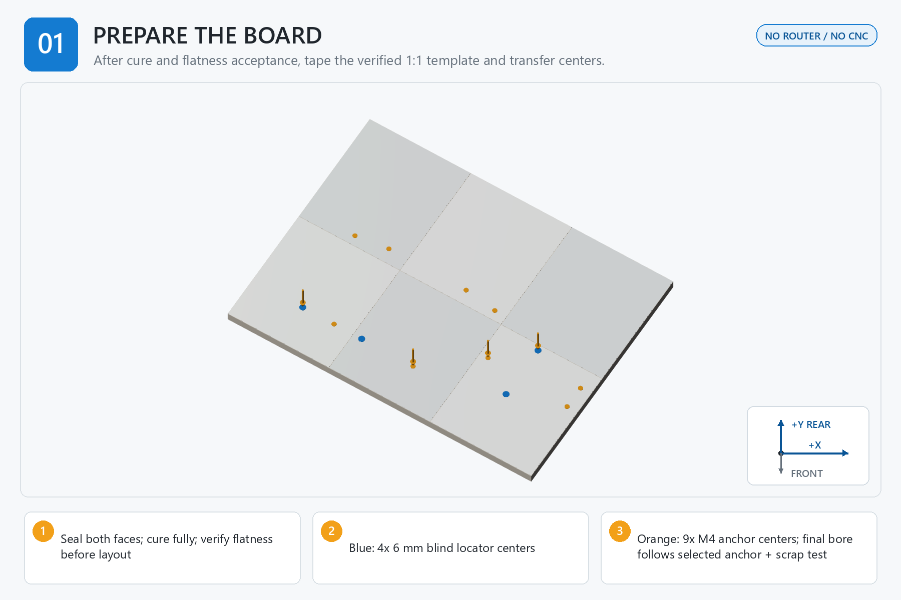

# Step 01 — Seal Mark and Drill the Board

[← Step 00](<../00 - Measure Hardware and Print Approved Parts/00 - START HERE.md>) | [Build dashboard](<../00 - START HERE.md>) | Next step locked

**Current result:** **LOCKED**  
**Next safe action:** Open [01 - BEFORE YOU START.md](<01 - BEFORE YOU START.md>) for the single prerequisite/gate table; do not begin or initialize evidence.  
**Engineering name:** Prepare and drill the structural board

## Goal

Create the flat, sealed, accurately indexed structural board using only a 1:1 paper template, hand drill, guides, and depth stops.

## Finished when

A cured 610 x 457 x 18 mm board with four blind locator interfaces and nine qualified M4 anchor interfaces, all inspected and labeled.

## Assembly image

## Open these files in order

1. [01 - BEFORE YOU START.md](<01 - BEFORE YOU START.md>)
2. [02 - PARTS AND TOOLS CHECKLIST.md](<02 - PARTS AND TOOLS CHECKLIST.md>)
3. [03A - PRINT AND ASSEMBLE THE BOARD DRILL GUIDE.md](<03A - PRINT AND ASSEMBLE THE BOARD DRILL GUIDE.md>)
4. [03B - PRINT SETTINGS FOR THIS STEP.md](<03B - PRINT SETTINGS FOR THIS STEP.md>)
5. [04 - STEP-BY-STEP INSTRUCTIONS.md](<04 - STEP-BY-STEP INSTRUCTIONS.md>)
6. [05 - CHECK YOUR WORK.md](<05 - CHECK YOUR WORK.md>)
7. [READ ME - WHAT TO RECORD.md](<06 - SAVE MEASUREMENTS AND PHOTOS/READ ME - WHAT TO RECORD.md>)
8. [07 - FINISH THIS STEP AND CONTINUE.md](<07 - FINISH THIS STEP AND CONTINUE.md>)

Model files: [03 - STL MODELS](<03 - STL MODELS/READ ME - HOW TO USE THESE MODELS.md>)  
Advanced records: [99 - TECHNICAL RECORDS - DO NOT EDIT](<99 - TECHNICAL RECORDS - DO NOT EDIT/OPEN CONTROLLED FILES.md>)

> **STOP:** Stop before center transfer or drilling if the board misses any released cut-size, thickness, opposite-edge, diagonal, flatness, or bow limit; any X/Y scale control is wrong; a Letter tile is butted instead of overlapped by 12 mm; registration or edge checks disagree; a station first article is unaccepted; a locator cannot meet both 15.00 +/- 0.20 mm depth and 2.00 mm minimum floor; or any anchor lacks a completed qualified FASTENER_MAP row and scrap-board proof.
