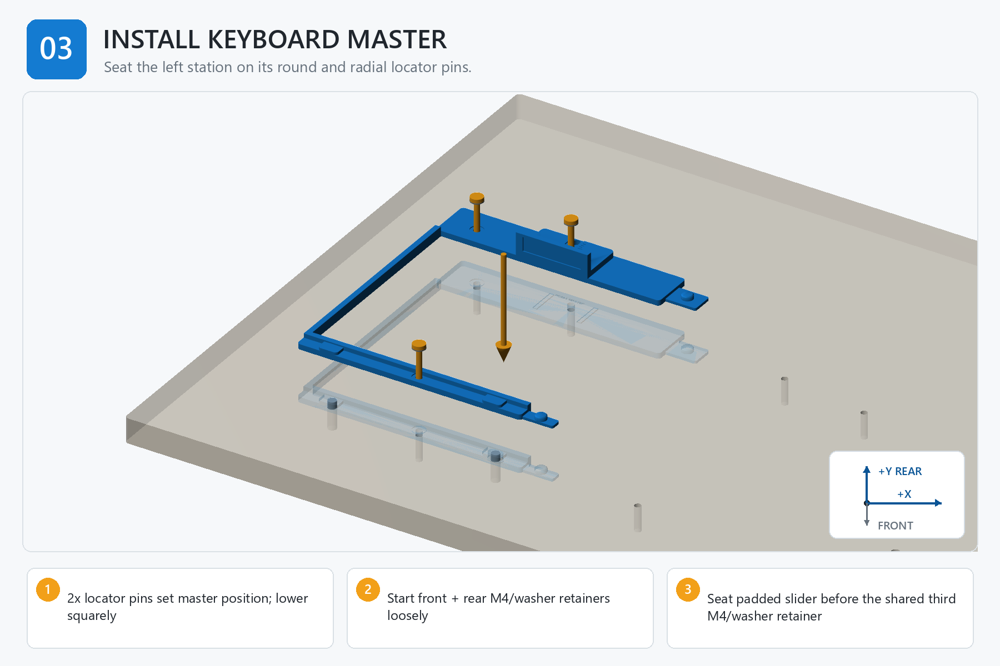

# Step 03 — Step-by-Step Instructions

**Generated reference — do not edit this file.**

## Orientation

- Origin: front-left corner of the finished board top.
- +X: right. +Y: rear/toward the arm. +Z: up.
- Confirm FRONT and +Y/rear before placing a part, device, template, or tag.

## Assembly image

The image explains order and orientation. Verify all schematic dimensions and hardware against the measured controls below.

## Files used in this step

Open these canonical project files for the actions below. The links point to the controlled originals; do not copy or rename them.

| Canonical file | Use in this step | Purpose |
| --- | --- | --- |
| [JOB_KITS.csv](<../../JOB_KITS.csv>) | Reference only | kitting source |
| [KEYBOARD_STATION_ENGINEERING_REVIEW.md](<../../KEYBOARD_STATION_ENGINEERING_REVIEW.md>) | Read | load-path review |
| [drawings/board_hole_coordinates.csv](<../../drawings/board_hole_coordinates.csv>) | Verify | feature control |
| [output/assembly_guide/images/03_install_keyboard_master.png](<../../output/assembly_guide/images/03_install_keyboard_master.png>) | View | assembly-step illustration |

## Numbered actions

1. Confirm FRONT and +Y/rear, then clean the board contact plane and station underside.
2. Place the accepted padded slider in the master guide, park it fully rearward, and hold it there before installing the shared third retainer.
3. Align both locator sockets over the round and radial pins; lower the station squarely without rocking or prying.
4. Start KBL-HOLD-F and KBL-HOLD-R with washers by hand and leave them loose.
5. Pass the KBL-CLAMP low-profile screw and washer through the slider and station into its board interface; leave it loose.
6. Press the continuous base gently against the board and tighten all three in stages to 0.25-0.35 N m while the slider remains parked rearward.
7. Verify the station is fully seated, the slider is captured in the parked position, and the seam posts remain clean and undamaged. The shared screw may lock slider motion until Step 05.

## STOP

> Do not force either locator, omit the slider from the shared stack, or tighten the shared screw as a device clamp before the keyboard is loaded.
