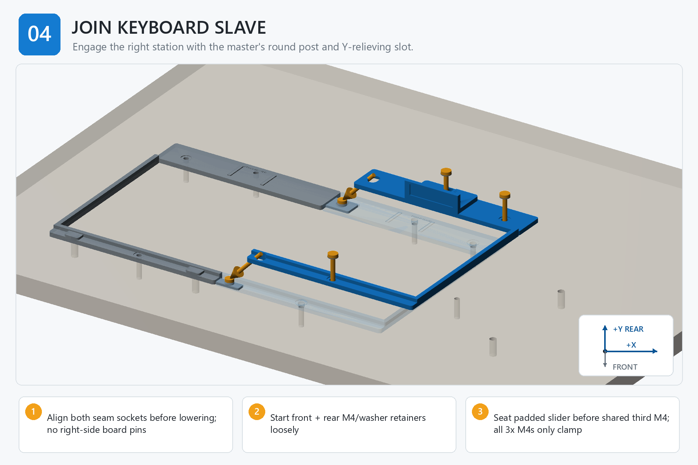

# Step 04 — Step-by-Step Instructions

**Generated reference — do not edit this file.**

## Orientation

- Origin: front-left corner of the finished board top.
- +X: right. +Y: rear/toward the arm. +Z: up.
- Confirm FRONT and +Y/rear before placing a part, device, template, or tag.

## Assembly image

The image explains order and orientation. Verify all schematic dimensions and hardware against the measured controls below.

## Files used in this step

Open these canonical project files for the actions below. The links point to the controlled originals; do not copy or rename them.

| Canonical file | Use in this step | Purpose |
| --- | --- | --- |
| [JOB_KITS.csv](<../../JOB_KITS.csv>) | Reference only | kitting source |
| [KEYBOARD_STATION_ENGINEERING_REVIEW.md](<../../KEYBOARD_STATION_ENGINEERING_REVIEW.md>) | Read | master/slave datum review |
| [drawings/board_hole_coordinates.csv](<../../drawings/board_hole_coordinates.csv>) | Verify | feature control |
| [output/assembly_guide/images/04_join_keyboard_slave.png](<../../output/assembly_guide/images/04_join_keyboard_slave.png>) | View | assembly-step illustration |

## Numbered actions

1. Place the second padded slider in the slave guide, park it fully rearward, and hold it there before the shared third retainer is installed.
2. Align both slave seam sockets with the master's round post and Y-relieving feature before lowering.
3. Lower the slave straight down and seat the seam by hand; there are no independent right-side locator pins.
4. Start KBR-HOLD-F and KBR-HOLD-R with washers loosely.
5. Pass KBR-CLAMP through the slider and relieved station hole into the board anchor; leave it loose.
6. Before final tightening, verify the selected screw in each of the three stacks has at least 5 mm of thread engagement and cannot bottom in a blind interface or project below the board; change only to a separately verified length if any stack fails this check.
7. Confirm the seam is fully seated, then tighten all three stacks incrementally to 0.25-0.35 N m with a low-range torque driver while the slider remains parked rearward; record the final torque for each named stack.
8. With the board unloaded, measure seam gap, flush mismatch, and the combined support plane, then press alternate slave-station corners and use a feeler gauge at any lifting corner to check for rocking.

## STOP

> Do not drill or add right-side locator pins. If the seam does not seat by hand, remove the slave and find the interference instead of pulling it together with screws.
