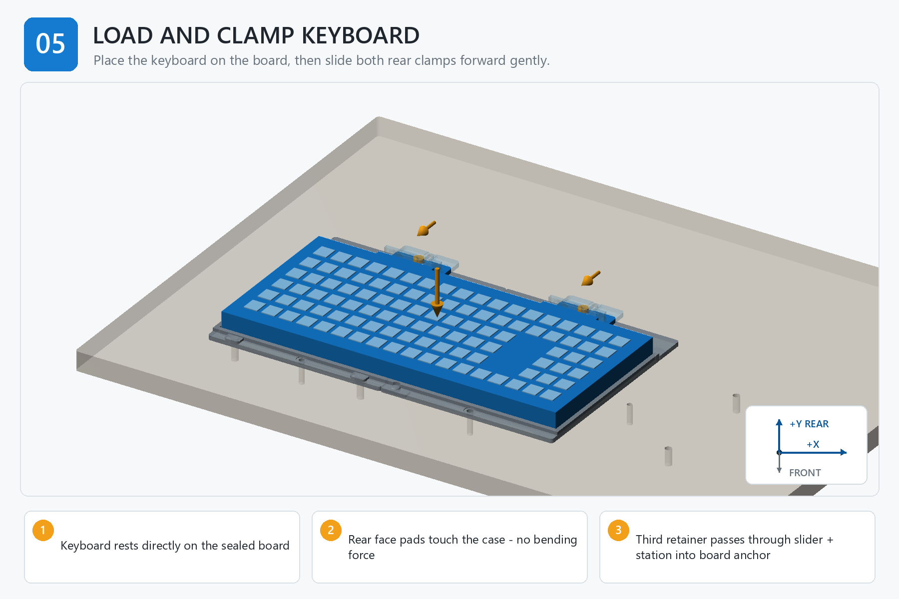

# Step 05 — Step-by-Step Instructions

**Generated reference — do not edit this file.**

## Orientation

- Origin: front-left corner of the finished board top.
- +X: right. +Y: rear/toward the arm. +Z: up.
- Confirm FRONT and +Y/rear before placing a part, device, template, or tag.

## Assembly image

The image explains order and orientation. Verify all schematic dimensions and hardware against the measured controls below.

## Files used in this step

Open these canonical project files for the actions below. The links point to the controlled originals; do not copy or rename them.

| Canonical file | Use in this step | Purpose |
| --- | --- | --- |
| [JOB_KITS.csv](<../../JOB_KITS.csv>) | Reference only | kitting source |
| [KEYBOARD_STATION_ENGINEERING_REVIEW.md](<../../KEYBOARD_STATION_ENGINEERING_REVIEW.md>) | Read | device/load review |
| [output/assembly_guide/images/05_load_keyboard_and_clamps.png](<../../output/assembly_guide/images/05_load_keyboard_and_clamps.png>) | View | assembly-step illustration |

## Numbered actions

1. Verify the four fixed station retainers remain at 0.25-0.35 N m. Work on only one shared slider screw at a time so the other retainers continue to seat the stations.
2. Loosen the first shared slider/station screw only enough for its slider to move; do not remove the screw or lift the station. Park both sliders away from the keyboard envelope.
3. Lower the keyboard onto the sealed board between the fixed front/side datums; do not rest it on printed ledges.
4. Confirm all existing keyboard feet contact the board and the case does not rock.
5. Route the keyboard cable with a relaxed bend and clearance from the seam, fasteners, tags, and arm motion.
6. Slide the loosened padded clamp forward until it just contacts the case, hold it at contact, and retorque that shared screw to 0.25-0.35 N m without bowing the keyboard shell.
7. Repeat the loosen-slide-retorque sequence on the other side, again changing only one shared screw at a time.
8. Remove and reinstall the keyboard ten times, verifying repeatable seating and gentle contact.

## STOP

> The sliders are retainers, not force clamps. Stop immediately if the keyboard bows, a foot lifts, a cable is pinched, or either slider binds.
