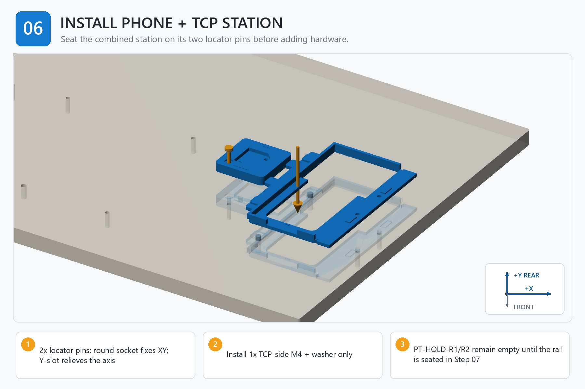

# Step 06 — Step-by-Step Instructions

**Generated reference — do not edit this file.**

## Orientation

- Origin: front-left corner of the finished board top.
- +X: right. +Y: rear/toward the arm. +Z: up.
- Confirm FRONT and +Y/rear before placing a part, device, template, or tag.

## Assembly image

The image explains order and orientation. Verify all schematic dimensions and hardware against the measured controls below.

## Files used in this step

Open these canonical project files for the actions below. The links point to the controlled originals; do not copy or rename them.

| Canonical file | Use in this step | Purpose |
| --- | --- | --- |
| [JOB_KITS.csv](<../../JOB_KITS.csv>) | Reference only | kitting source |
| [RC03_INTEGRATED_BUILD_PLAN.md](<../../RC03_INTEGRATED_BUILD_PLAN.md>) | Read | station architecture |
| [drawings/board_hole_coordinates.csv](<../../drawings/board_hole_coordinates.csv>) | Verify | feature control |
| [output/assembly_guide/images/06_install_phone_tcp_station.png](<../../output/assembly_guide/images/06_install_phone_tcp_station.png>) | View | assembly-step illustration |

## Numbered actions

1. Confirm the station's M3 inserts are square, flush to the selected depth, and free of debris before board installation.
2. Clean the board and continuous station base, then align the round and radial sockets over the two phone-station pins.
3. Lower the station squarely without twisting or prying.
4. Install PT-HOLD-TCP with its washer by hand. Confirm the washer lies flat at the bottom of the 1.5 mm recess, gauge at least 5.0 mm useful thread engagement, and confirm there is no bottoming or underside projection before tightening to 0.25-0.35 N m.
5. Leave PT-HOLD-R1 and PT-HOLD-R2 empty; those fasteners pass through the service rail in Step 08.
6. Verify the rail interface, cable-saddle approach, phone datums, and TCP receiver are unobstructed.

## STOP

> Do not install either rail-side board screw before the rail is fully seated. Do not heat-set inserts while the station is mounted on the finished board.
