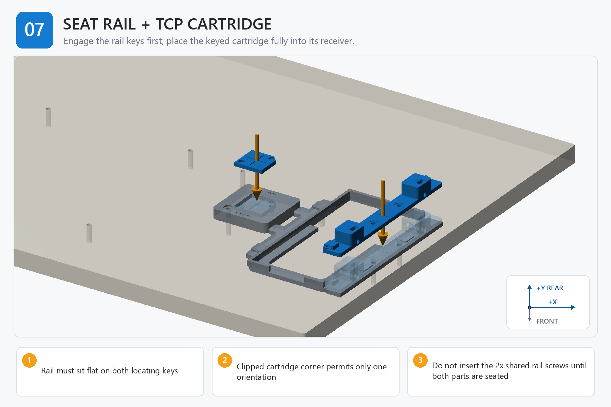

# Step 07 — Step-by-Step Instructions

**Generated reference — do not edit this file.**

## Orientation

- Origin: front-left corner of the finished board top.
- +X: right. +Y: rear/toward the arm. +Z: up.
- Confirm FRONT and +Y/rear before placing a part, device, template, or tag.

## Assembly image

The image explains order and orientation. Verify all schematic dimensions and hardware against the measured controls below.

## Files used in this step

Open these canonical project files for the actions below. The links point to the controlled originals; do not copy or rename them.

| Canonical file | Use in this step | Purpose |
| --- | --- | --- |
| [JOB_KITS.csv](<../../JOB_KITS.csv>) | Reference only | kitting source |
| [RC03_INTEGRATED_BUILD_PLAN.md](<../../RC03_INTEGRATED_BUILD_PLAN.md>) | Read | service-interface definition |
| [output/assembly_guide/images/07_seat_phone_rail_and_cartridge.png](<../../output/assembly_guide/images/07_seat_phone_rail_and_cartridge.png>) | View | assembly-step illustration |

## Numbered actions

1. Inspect and clean both rail locating keys, the rail underside, cartridge receiver, and cartridge datum face.
2. Approach the rail squarely, engage both keys, and lower it until the entire seating interface lies flat.
3. Do not use PT-HOLD-R1/R2 to pull an unseated rail into place.
4. Match the INSTALL label to calibration_puck_datum_pass.installed_cartridge_id. Keep the SPARE cartridge protected; do not substitute it by feel.
5. Orient the cartridge by its clipped corner and lower it fully into the keyed receiver.
6. Confirm both cartridge screw holes align without shifting the cartridge.
7. Check that the rail cable saddle faces the intended front exit and both clamp towers are clear.

## STOP

> Do not install shared rail screws or cartridge screws until both parts sit fully flush by hand. Never pull a misaligned part into place with hardware.
