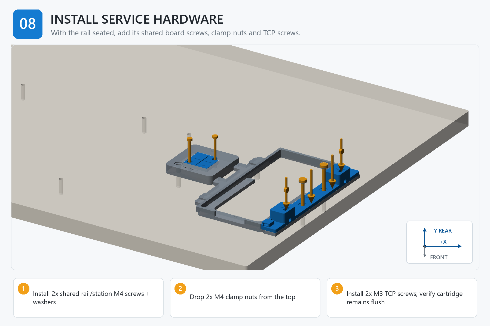

# Step 08 — Secure Phone Rail and Tool Cartridge

[← Step 07](<../07 - Fit Phone Rail and Tool Cartridge/00 - START HERE.md>) | [Build dashboard](<../00 - START HERE.md>) | Next step locked

**Current result:** **LOCKED**  
**Next safe action:** Open [01 - BEFORE YOU START.md](<01 - BEFORE YOU START.md>) for the single prerequisite/gate table; do not begin or initialize evidence.  
**Engineering name:** Install the phone service hardware

## Goal

Lock the already seated rail and cartridge with the correct shared board, clamp-nut, and TCP fastener sequence.

## Finished when

All three station anchors, both clamp nuts, and both TCP screws are installed without lifting the rail or distorting the cartridge datum.

## Assembly image

## Open these files in order

1. [01 - BEFORE YOU START.md](<01 - BEFORE YOU START.md>)
2. [02 - PARTS AND TOOLS CHECKLIST.md](<02 - PARTS AND TOOLS CHECKLIST.md>)
3. [03B - PRINT SETTINGS FOR THIS STEP.md](<03B - PRINT SETTINGS FOR THIS STEP.md>)
4. [04 - STEP-BY-STEP INSTRUCTIONS.md](<04 - STEP-BY-STEP INSTRUCTIONS.md>)
5. [05 - CHECK YOUR WORK.md](<05 - CHECK YOUR WORK.md>)
6. [READ ME - WHAT TO RECORD.md](<06 - SAVE MEASUREMENTS AND PHOTOS/READ ME - WHAT TO RECORD.md>)
7. [07 - FINISH THIS STEP AND CONTINUE.md](<07 - FINISH THIS STEP AND CONTINUE.md>)

Model files: [03 - STL MODELS](<03 - STL MODELS/READ ME - HOW TO USE THESE MODELS.md>)  
Advanced records: [99 - TECHNICAL RECORDS - DO NOT EDIT](<99 - TECHNICAL RECORDS - DO NOT EDIT/OPEN CONTROLLED FILES.md>)

> **STOP:** Stop if a shared M4 stack lifts the rail, a clamp nut spins or cracks its tower, or an M3 screw changes cartridge height or flushness.
