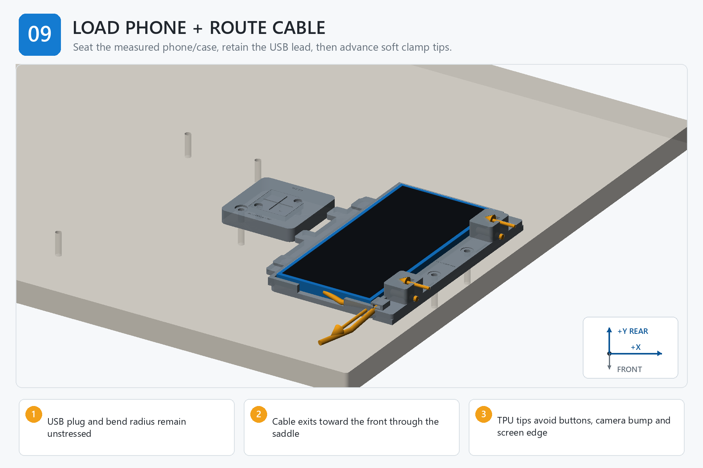

# Step 09 — Step-by-Step Instructions

**Generated reference — do not edit this file.**

## Orientation

- Origin: front-left corner of the finished board top.
- +X: right. +Y: rear/toward the arm. +Z: up.
- Confirm FRONT and +Y/rear before placing a part, device, template, or tag.

## Assembly image

The image explains order and orientation. Verify all schematic dimensions and hardware against the measured controls below.

## Files used in this step

Open these canonical project files for the actions below. The links point to the controlled originals; do not copy or rename them.

| Canonical file | Use in this step | Purpose |
| --- | --- | --- |
| [JOB_KITS.csv](<../../JOB_KITS.csv>) | Reference only | kitting source |
| [output/assembly_guide/images/09_load_phone_and_route_cable.png](<../../output/assembly_guide/images/09_load_phone_and_route_cable.png>) | View | assembly-step illustration |

## Numbered actions

1. Fit one accepted TPU tip to each clamp screw and confirm the pull-off witness band remains intact.
2. Back both clamp screws fully away from the phone envelope.
3. Connect the USB lead and seat the phone against the fixed front and side datums without trapping the cable.
4. Route the cable toward the front through the rail saddle, preserving the measured straight projection and bend radius.
5. Close the tie only enough to retain the lead while allowing service removal.
6. Advance each soft tip until it just touches the approved case region; do not use clamp force to reposition the phone.
7. Cycle phone removal, cable connection, seating, and gentle retention ten times.

## STOP

> Stop if the connector carries load, the tie changes the bend radius, a tip approaches glass or a side feature, or clamp pressure shifts the phone.
