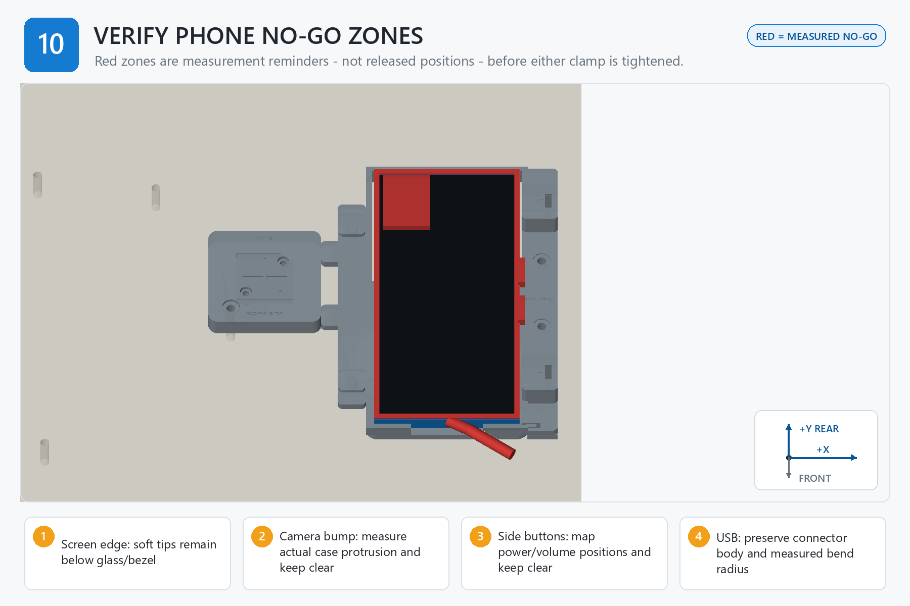

# Step 10 — Step-by-Step Instructions

**Generated reference — do not edit this file.**

## Orientation

- Origin: front-left corner of the finished board top.
- +X: right. +Y: rear/toward the arm. +Z: up.
- Confirm FRONT and +Y/rear before placing a part, device, template, or tag.

## Assembly image

The image explains order and orientation. Verify all schematic dimensions and hardware against the measured controls below.

## Files used in this step

Open these canonical project files for the actions below. The links point to the controlled originals; do not copy or rename them.

| Canonical file | Use in this step | Purpose |
| --- | --- | --- |
| [JOB_KITS.csv](<../../JOB_KITS.csv>) | Reference only | kitting source |
| [output/assembly_guide/images/10_verify_phone_no_go_zones.png](<../../output/assembly_guide/images/10_verify_phone_no_go_zones.png>) | View | assembly-step illustration |

## Numbered actions

1. Verify both TPU tips remain below and outside the screen/glass edge.
2. Measure the actual camera-bump protrusion and confirm no tower, screw, cable, or tip enters its envelope.
3. Map the power and volume controls in the loaded pose and measure margin from both clamp axes.
4. Inspect the USB connector body, straight projection, bend, saddle, and exit path from the front and side.
5. Operate every side button manually and lightly disturb the cable; confirm neither clamp nor cable causes an input.
6. Record the minimum measured keepout margin and photograph all four no-go regions.

## STOP

> The red regions in the illustration are not released dimensions. Stop and revise the measured clamp centers or cable route if any actual feature lacks a positive recorded margin.
