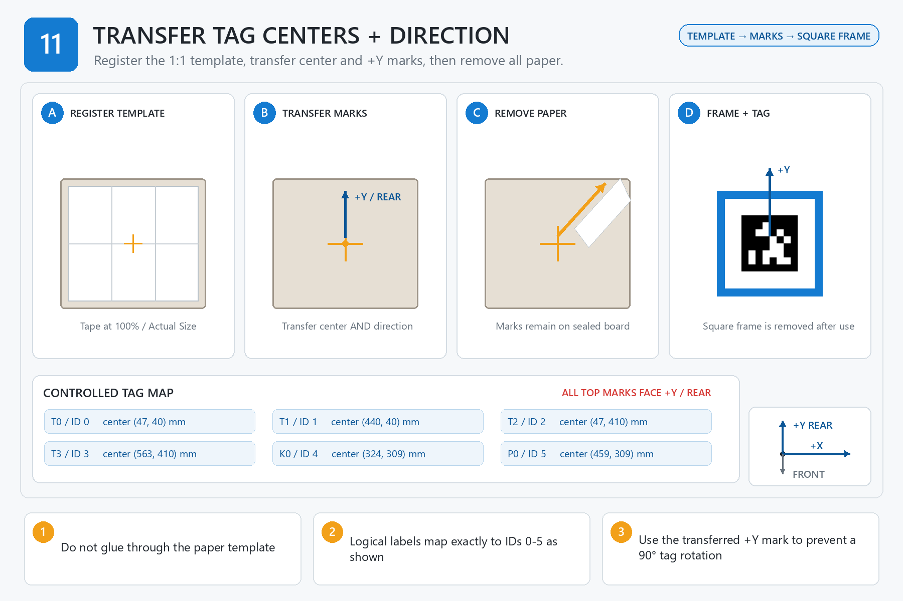

# Step 11 — Mark AprilTag Locations

[← Step 10](<../10 - Check Phone Clearances/00 - START HERE.md>) | [Build dashboard](<../00 - START HERE.md>) | Next step locked

**Current result:** **LOCKED**  
**Next safe action:** Open [01 - BEFORE YOU START.md](<01 - BEFORE YOU START.md>) for the single prerequisite/gate table; do not begin or initialize evidence.  
**Engineering name:** Transfer the AprilTag centers and +Y direction

## Goal

Use the verified paper template only to transfer six centers and orientation marks onto the cured board.

## Finished when

All six tag centers and +Y/rear orientation marks are visible on the board, and all paper has been removed before adhesive work.

## Assembly image

## Open these files in order

1. [01 - BEFORE YOU START.md](<01 - BEFORE YOU START.md>)
2. [02 - PARTS AND TOOLS CHECKLIST.md](<02 - PARTS AND TOOLS CHECKLIST.md>)
3. [03B - PRINT SETTINGS FOR THIS STEP.md](<03B - PRINT SETTINGS FOR THIS STEP.md>)
4. [04 - STEP-BY-STEP INSTRUCTIONS.md](<04 - STEP-BY-STEP INSTRUCTIONS.md>)
5. [05 - CHECK YOUR WORK.md](<05 - CHECK YOUR WORK.md>)
6. [READ ME - WHAT TO RECORD.md](<06 - SAVE MEASUREMENTS AND PHOTOS/READ ME - WHAT TO RECORD.md>)
7. [07 - FINISH THIS STEP AND CONTINUE.md](<07 - FINISH THIS STEP AND CONTINUE.md>)

Model files: [03 - STL MODELS](<03 - STL MODELS/READ ME - HOW TO USE THESE MODELS.md>)  
Advanced records: [99 - TECHNICAL RECORDS - DO NOT EDIT](<99 - TECHNICAL RECORDS - DO NOT EDIT/OPEN CONTROLLED FILES.md>)

> **STOP:** Do not glue through the paper. Stop if the guide route/path/hash differs from Step 00, either scale bar is wrong, a Letter tile uses pages 1-3 or is butted instead of overlapped by 12 mm with matching IDs, the full-size page is cropped/scaled, the template is stretched, FRONT/+Y is ambiguous, or any transferred center cannot be reconciled to the coordinate CSV.
