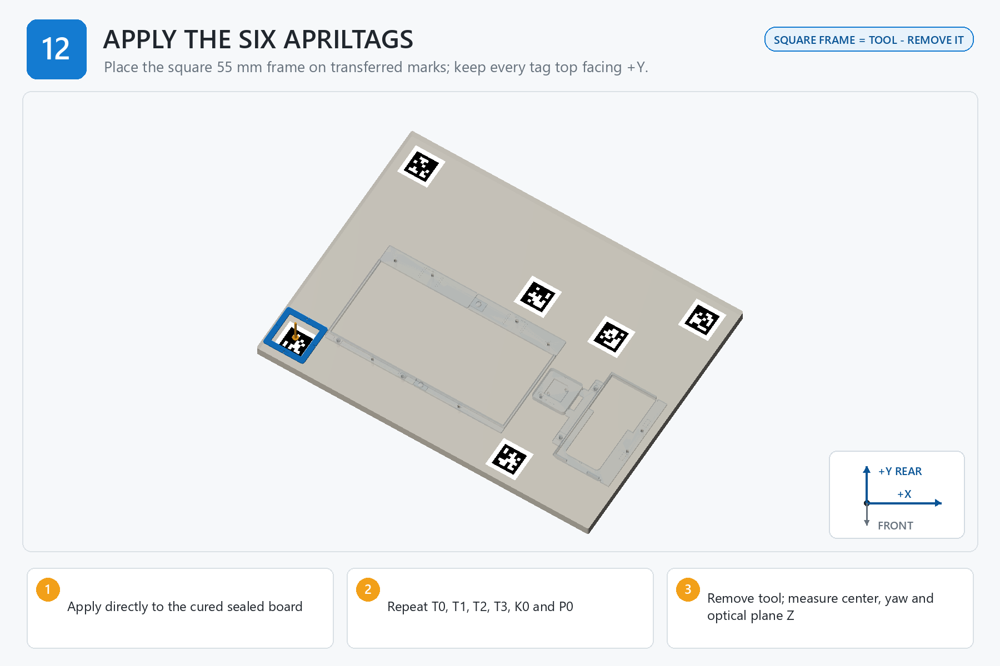

# Step 12 — Attach and Measure AprilTags

[← Step 11](<../11 - Mark AprilTag Locations/00 - START HERE.md>) | [Build dashboard](<../00 - START HERE.md>) | Next step locked

**Current result:** **LOCKED**  
**Next safe action:** Open [01 - BEFORE YOU START.md](<01 - BEFORE YOU START.md>) for the single prerequisite/gate table; do not begin or initialize evidence.  
**Engineering name:** Apply and measure the six AprilTags

## Goal

Apply IDs 0-5 directly to the cured board with full-surface matte adhesive and measure their installed optical geometry.

## Finished when

Six correctly oriented tags are flat and physically measured, and a measured-installation runtime map is generated for Step 13; the application frame is removed and stored.

## Assembly image

## Open these files in order

1. [01 - BEFORE YOU START.md](<01 - BEFORE YOU START.md>)
2. [02 - PARTS AND TOOLS CHECKLIST.md](<02 - PARTS AND TOOLS CHECKLIST.md>)
3. [03B - PRINT SETTINGS FOR THIS STEP.md](<03B - PRINT SETTINGS FOR THIS STEP.md>)
4. [04 - STEP-BY-STEP INSTRUCTIONS.md](<04 - STEP-BY-STEP INSTRUCTIONS.md>)
5. [05 - CHECK YOUR WORK.md](<05 - CHECK YOUR WORK.md>)
6. [READ ME - WHAT TO RECORD.md](<06 - SAVE MEASUREMENTS AND PHOTOS/READ ME - WHAT TO RECORD.md>)
7. [07 - FINISH THIS STEP AND CONTINUE.md](<07 - FINISH THIS STEP AND CONTINUE.md>)

Model files: [03 - STL MODELS](<03 - STL MODELS/READ ME - HOW TO USE THESE MODELS.md>)  
Advanced records: [99 - TECHNICAL RECORDS - DO NOT EDIT](<99 - TECHNICAL RECORDS - DO NOT EDIT/OPEN CONTROLLED FILES.md>)

> **STOP:** Stop if a tile is glossy, scaled, damaged, rotated, misidentified, only spot-taped, or outside placement limits. Do not leave the printed application frame on the board.
