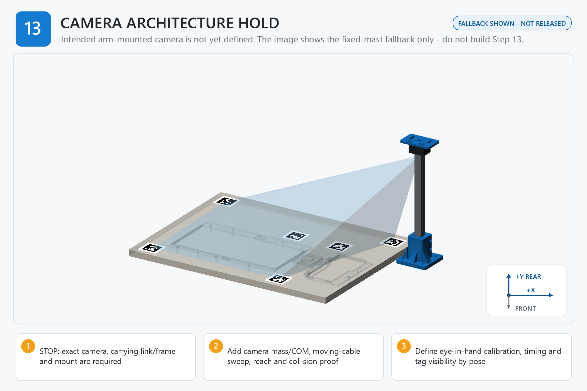

# Step 13 — Mount and Calibrate Camera

[← Step 12](<../12 - Attach and Measure AprilTags/00 - START HERE.md>) | [Build dashboard](<../00 - START HERE.md>) | Next step locked

**Current result:** **LOCKED**  
**Next safe action:** Open [01 - BEFORE YOU START.md](<01 - BEFORE YOU START.md>) for the single prerequisite/gate table; do not begin or initialize evidence.  
**Engineering name:** Resolve the camera architecture, then mount and prove route-specific vision

## Goal

After the camera architecture is formally aligned, mount the exact measured camera, calibrate it with the route-specific transform method, and prove the required view, timing, cable, payload, and collision envelope. The fixed six-tag eye-to-hand procedure below is retained only as the current independent-mast fallback.

## Finished when

The camera architecture no longer conflicts with config/camera_architecture_decision.json; the exact mount, camera, cable, calibration chain, visibility set, and motion consequences are controlled and physically accepted.

## Assembly image

## Open these files in order

1. [01 - BEFORE YOU START.md](<01 - BEFORE YOU START.md>)
2. [02 - PARTS AND TOOLS CHECKLIST.md](<02 - PARTS AND TOOLS CHECKLIST.md>)
3. [03B - PRINT SETTINGS FOR THIS STEP.md](<03B - PRINT SETTINGS FOR THIS STEP.md>)
4. [04 - STEP-BY-STEP INSTRUCTIONS.md](<04 - STEP-BY-STEP INSTRUCTIONS.md>)
5. [05 - CHECK YOUR WORK.md](<05 - CHECK YOUR WORK.md>)
6. [READ ME - WHAT TO RECORD.md](<06 - SAVE MEASUREMENTS AND PHOTOS/READ ME - WHAT TO RECORD.md>)
7. [07 - FINISH THIS STEP AND CONTINUE.md](<07 - FINISH THIS STEP AND CONTINUE.md>)

Model files: [03 - STL MODELS](<03 - STL MODELS/READ ME - HOW TO USE THESE MODELS.md>)  
Advanced records: [99 - TECHNICAL RECORDS - DO NOT EDIT](<99 - TECHNICAL RECORDS - DO NOT EDIT/OPEN CONTROLLED FILES.md>)

> **STOP:** Stop while config/camera_architecture_decision.json is ENGINEERING_ALIGNMENT_HOLD. The user-intended arm-mounted architecture is not released by the fixed-camera illustration, mast files, plate, or eye-to-hand commands. After formal alignment, also stop if the exact support is unmeasured, the camera moves, a screw can bottom, the moving cable is unqualified, the calibrated transform method does not match the mount architecture, or any route-required target leaves its accepted view.
