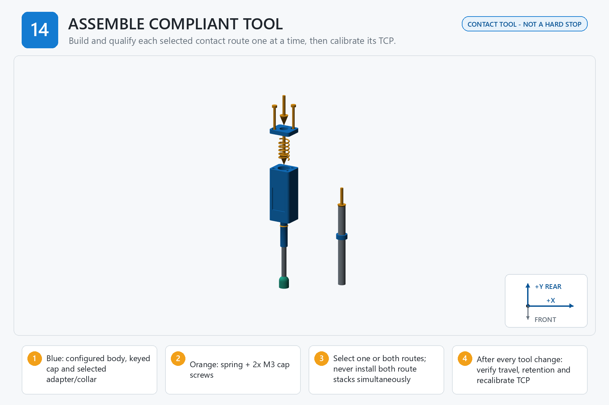

# Step 14 — Step-by-Step Instructions

**Generated reference — do not edit this file.**

## Orientation

- Origin: front-left corner of the finished board top.
- +X: right. +Y: rear/toward the arm. +Z: up.
- Confirm FRONT and +Y/rear before placing a part, device, template, or tag.

## Assembly image

The image explains order and orientation. Verify all schematic dimensions and hardware against the measured controls below.

## Files used in this step

Open these canonical project files for the actions below. The links point to the controlled originals; do not copy or rename them.

| Canonical file | Use in this step | Purpose |
| --- | --- | --- |
| [JOB_KITS.csv](<../../JOB_KITS.csv>) | Reference only | kitting source |
| [RC03_INTEGRATED_BUILD_PLAN.md](<../../RC03_INTEGRATED_BUILD_PLAN.md>) | Read | route architecture |
| [output/assembly_guide/images/14_assemble_compliant_tool.png](<../../output/assembly_guide/images/14_assemble_compliant_tool.png>) | View | assembly-step illustration |

## Numbered actions

1. Confirm every selected route in the canonical measurement record. Label and segregate unselected-route parts; if both routes are selected, stage two labeled configurations and test them one at a time.
2. Install the two M3 inserts square in the compliant body using the accepted pocket and installation method.
3. Fit the selected spring and confirm it is centered, unbound, and clear of the sliding member.
4. Install the first selected route: either the accepted 6 mm rod/bushing/TPU tip stack or the accepted measured stylus/collar stack.
5. Align the keyed cap and install both M3 screws evenly without washers unless the released design is revised.
6. Cycle full compliant travel at least 20 times; measure travel and compression force at the engineering-approved checkpoints, and verify full return, no coil bind, no scraping, and secure route retention.
7. Install in the RoArm gripper using the accepted grip interface. Perform at least ten remove/reinstall/probe cycles and compare the XYZ range with the numeric TCP limit selected before assembly.
8. If a second route is selected, remove and label the first configuration, assemble the second route, and repeat every travel, force, retention, function, and TCP test.

## STOP

> This is a contact tool, not a hard stop. Stop if travel binds, the spring coil-binds, the cap distorts, the adapter slips, or the selected contact route is not explicitly recorded.
