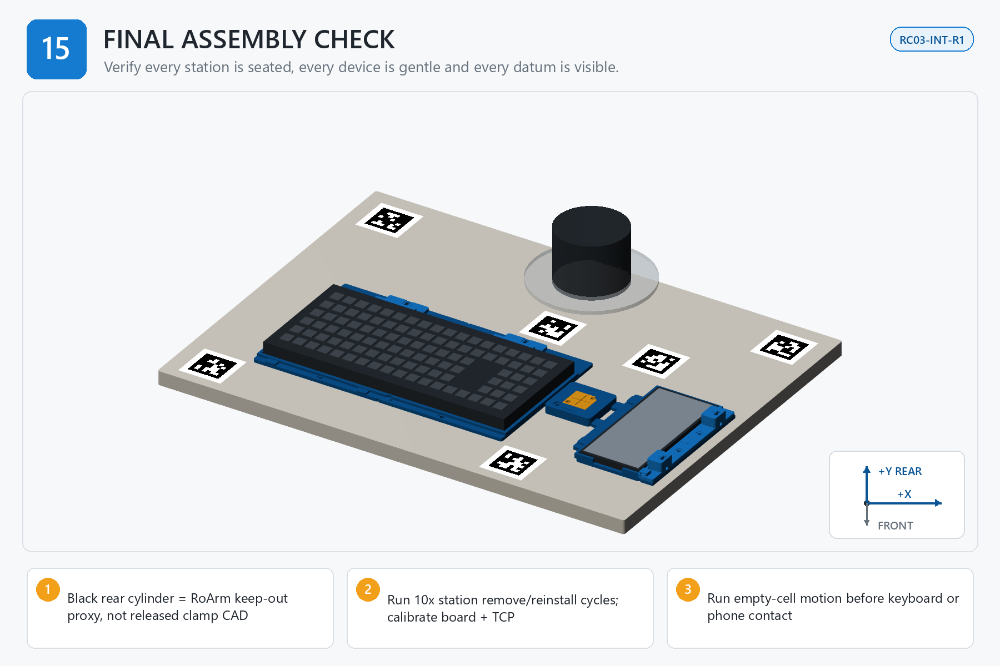

# Step 15 — Step-by-Step Instructions

**Generated reference — do not edit this file.**

## Orientation

- Origin: front-left corner of the finished board top.
- +X: right. +Y: rear/toward the arm. +Z: up.
- Confirm FRONT and +Y/rear before placing a part, device, template, or tag.

## Assembly image

The image explains order and orientation. Verify all schematic dimensions and hardware against the measured controls below.

## Files used in this step

Open these canonical project files for the actions below. The links point to the controlled originals; do not copy or rename them.

| Canonical file | Use in this step | Purpose |
| --- | --- | --- |
| [ASSEMBLY_MANUAL.pdf](<../../ASSEMBLY_MANUAL.pdf>) | Complete this controlled record, Read | controlled detailed manual, controlled procedure |
| [RELEASE_VALIDATION.json](<../../RELEASE_VALIDATION.json>) | Verify digital record; not physical release | digital package validation |
| [fiducials/apriltag_map.json](<../../fiducials/apriltag_map.json>) | Use with the named helper | runtime tag map |
| [output/assembly_guide/images/15_final_cell.png](<../../output/assembly_guide/images/15_final_cell.png>) | View | assembly-step illustration |
| [output/pdf/RC03_ILLUSTRATED_ASSEMBLY_GUIDE.pdf](<../../output/pdf/RC03_ILLUSTRATED_ASSEMBLY_GUIDE.pdf>) | Complete this controlled record, Read | complete illustrated guide, visual procedure and signoff |
| [software_helpers/detect_apriltags.py](<../../software_helpers/detect_apriltags.py>) | Run from the project root | final vision verification |

## Numbered actions

1. Before robot enable, verify the engineering-approved controller/firmware, E-stop implementation, board anti-shift implementation, homing/reference procedure, empty-cell program, final-process program, TCP speed (mm/s), TCP acceleration (mm/s^2), contact force (N), travel/clearance (mm), and 20 N/10 N proof-duration (s) record is PASS; verify every artifact SHA-256 and confirm the 50 N axial anchor proof duration is fixed at 60 seconds. If any approved field is blank, missing, stale, or changed by an operator, place commissioning on HOLD.
2. Reconcile every prior step folder: required evidence present, no unresolved HOLD, installed/spare counts correct, and no unapproved rework.
3. Torque-audit all nine board interfaces and inspect for bottoming, underside projection, veneer damage, base lift, and rail or slider mis-seating.
4. Remove and reinstall each station ten times; record X/Y, yaw, and Z repeatability and recheck the keyboard seam and TCP cartridge.
5. Run the board-tag detector and confirm all six tags meet detection and reprojection limits with the final camera settings.
6. Proof board anchors and station loads with the defined instruments and durations; record permanent shift.
7. Remove devices and removable tools, follow the approved homing/reference procedure, test the approved E-stop cutoff/reset and board anti-shift implementation, apply the recorded commissioning speed/force limits, and run only the SHA-256-bound empty-cell program.
8. Measure minimum clearance to the board, clamp proxy, camera support, cables, stations, and tag plane.
9. Load and verify one device at a time; perform first contact at controlled speed and force with an observer at the E-stop.
10. Run only the SHA-256-bound final-process program, then complete the physical release decision, responsible signature, date, revision, and evidence archive.
11. Update config/measurement_record.json through the controlled recording workflow and update sequential job lifecycle evidence in config/job_build_record.json. Regenerate BUILD_TRACKER.md/.json, JOB_KITS.csv-derived kit status, job cards, and this step package; verify the final records, then archive the immutable build-ID evidence.

## STOP

> Digital PASS is not physical release. Do not enable automatic device contact until every measured gate is in limit, evidence is archived, the E-stop works, and the physical release decision is signed.
