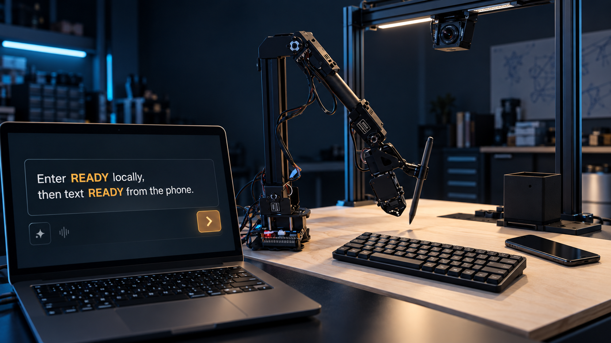
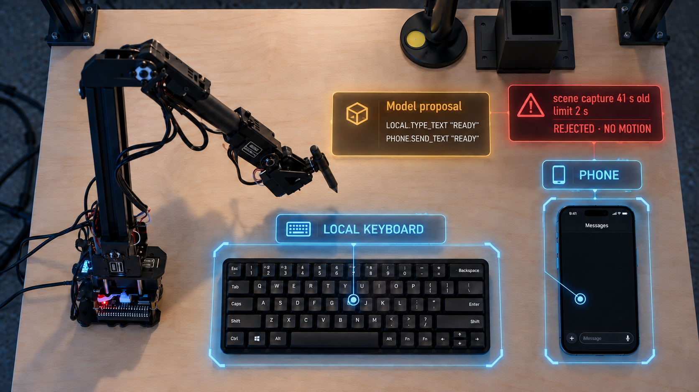
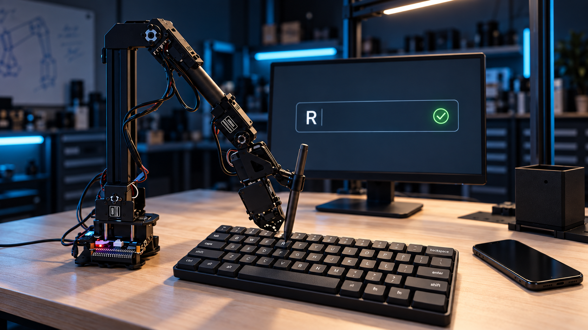
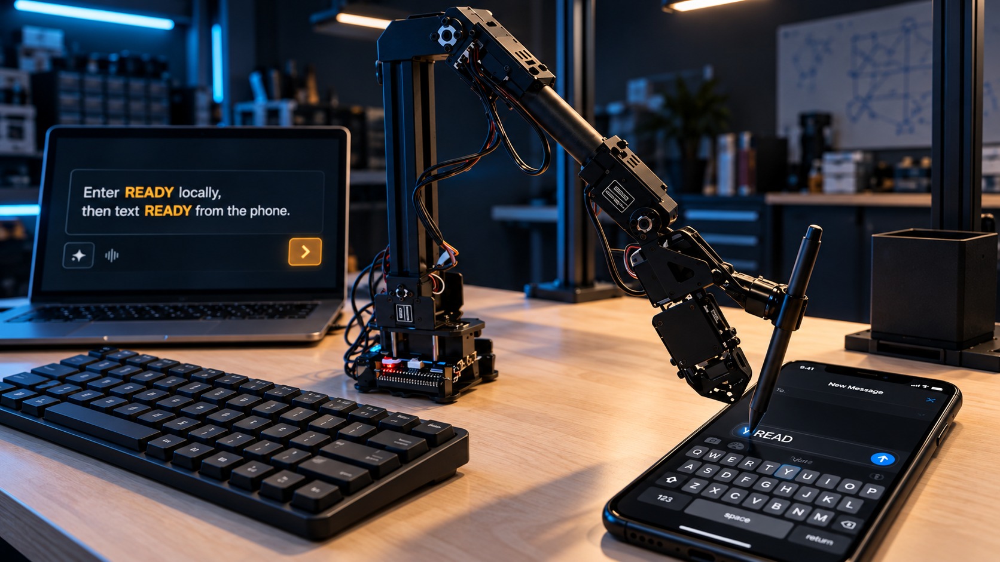
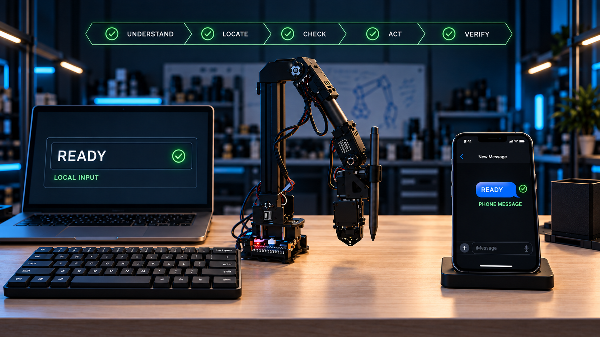

# Tactevra advertising storyboard handoff

- **Purpose:** Art-direction and scene-development brief
- **Film target:** 100 seconds, 16:9 master, 24 fps
- **Audience:** Advertising creative director, storyboard artist, motion
  designer, cinematographer, sound designer, and Blender artist
- **Status:** Concept package; the images below are visual mockups, not final
  renders or engineering evidence

## The idea in one sentence

One natural-language request becomes two separately checked physical outcomes:
the robot enters `READY` into a local computer through a physical keyboard,
then independently sends `READY` from a phone through physical screen taps.

## What the viewer should feel

Tactevra is not a robot performing a party trick. It is a disciplined bridge
between AI intent and physical interfaces. The film should begin with curiosity,
introduce a credible risk, build trust through the rejection and admission
beats, create energy through coordinated motion, and end with the calm
confidence of two independently verified results.

## Visual authority warning

The five images in this handoff are generated advertising concepts. Use them
for composition, lighting, hierarchy, color, camera language, and emotional
tone. Do **not** copy their incidental geometry, key layout, screen details,
labels, cable paths, or robot joint construction into the production scene.

Production must use the repository's dimension manifest, official arm source,
exact board tags, measured device envelopes, indexed transforms, accurate
keyboard asset, phone asset, and the continuity requirements in
[`TACTEVRA_OVERVIEW_STORYBOARD_V2.md`](TACTEVRA_OVERVIEW_STORYBOARD_V2.md).

## Five visual anchors

### 1. Human intent enters the physical world

**Story purpose:** Establish immediately that the laptop is the operator
console, while the keyboard and phone are separate physical targets.

**Keep:** Foreground-to-background depth, readable request, parked robot,
stylus visible before motion, complete workcell, blue-and-amber lighting.

**Improve in production:** Match the real board layout and portal; seat the
stylus exactly inside the real gripper; use the accurate compact keyboard and
phone; reduce background laboratory clutter; reserve negative space for
captions and stage labels.

**Camera:** 32–38 mm equivalent, slow 12-degree orbit with a restrained push.

**Transition:** Match-cut the word `READY` to the first amber proposal row.

### 2. One intent contract, two independent device maps

**Story purpose:** Explain the architecture at a glance. The model proposes
two device-qualified intentions. Deterministic software rejects stale scene
evidence before either device is touched.

**Keep:** Stable overhead geometry, blue device boundaries, amber proposal,
red one-glance rejection, stationary robot, information placed in unused board
space.

**Improve in production:** Use the exact physical-keyboard map, actual phone
app-state model, exact tag family/IDs, and clean copy from the production
storyboard. Keep a visible gap between the two blue device maps. Never draw an
arrow from the keyboard output to the phone.

**Camera:** Fixed overhead, squared to the board. No orbit during rejection.

**Sound:** Four quiet registration pings, then a muted low thud on `REJECTED`.

### 3. Local typing is a local workflow

**Story purpose:** Show the first useful outcome. The robot physically presses
the keyboard while the associated local input changes. The phone remains idle.

**Keep:** Entire mechanism visible, low three-quarter angle, readable key
contact, stylus-to-key relationship, independent phone in frame, local result
behind the keyboard.

**Improve in production:** Animate the accurate RoArm rig rather than the
concept geometry; visibly seat the stylus between both jaws; use correct R/E/A/D/Y
locations; show restrained cap travel; keep the phone screen unchanged for the
whole local sequence.

**Camera:** 55–70 mm equivalent lateral track. Use no more than two sub-two-
second macro inserts across all five key presses.

**Sound:** Five distinct physical-key clicks. Let the rhythm carry the shot;
do not cover it with narration.

### 4. The phone is a separate physical interface

**Story purpose:** Demonstrate a second adapter and interaction vocabulary.
The arm crosses the workcell, opens Messages, taps the phone's own on-screen
keys, then reaches Send. The keyboard has finished its job.

**Keep:** Strong diagonal travel, spatial separation, phone foreground,
keyboard receding, full robot readable, screen interaction visibly physical.

**Improve in production:** Use the exact phone transform and screen plane;
animate a plausible wrist reorientation; make the on-screen target under the
stylus unambiguous; leave the local input at `READY`; do not repeat the operator
request on the local-result display.

**Camera:** 40–55 mm equivalent diagonal dolly that begins on the retract from
the keyboard and lands on the phone hover pose.

**Sound:** Quiet transit mechanism tone, Messages tap, five glass taps, and one
distinct Send tap.

### 5. Independent evidence, shared confidence

**Story purpose:** Close the promise without merging the workflows. The local
computer independently confirms its input. The phone independently confirms
its sent message. The five-stage contract explains why both results can be
trusted.

**Keep:** Symmetrical hierarchy, safely retracted arm centered between devices,
separate result panels, confident green completion state, strong stage ribbon.

**Improve in production:** Restore the complete board and portal silhouette;
use the exact stylus and robot; show the phone's sent state rather than an
editable composer; ensure the local and phone receipts use distinct labels and
never visually join before the final architectural summary.

**Camera:** 35–40 mm equivalent, slow pullback into the end composition.

**Sound:** Two quiet verification ticks followed by one restrained resolved
chord.

## Complete 15-scene director's board

| # | Time | Required picture | Camera and blocking | Graphic purpose | Sound |
|---:|---:|---|---|---|---|
| 1 | 0:00–0:05 | Operator console receives: `Enter READY locally, then text READY from the phone.` | Close console view; workcell soft in background | Human outcome, not motor instruction | Minimal input ticks |
| 2 | 0:05–0:11 | Full workcell; arm parked; stylus clamped; keyboard, local display, and phone visibly separate | 12–15° hero orbit | Physical stakes | Bed and restrained room tone |
| 3 | 0:11–0:18 | Amber `LOCAL.TYPE_TEXT` then `PHONE.SEND_TEXT` proposal | Settle beside stationary robot | Model proposes; no motor commands | Amber UI ticks |
| 4 | 0:18–0:25 | Camera body, lens transition, exact tags, three device detections | Crane to fixed camera, then squared overhead | Ground the scene | Four registration pings |
| 5 | 0:25–0:31 | Separate local-keyboard/local-display map and phone map | Locked overhead | Device-specific targets | Quiet trace tone |
| 6 | 0:31–0:37 | `scene capture 41 s old · limit 2 s`; robot stays still | No camera motion | Fail closed | Low reject thud |
| 7 | 0:37–0:44 | Fresh evidence; full two-routine route; 12 contacts admitted | Slow push toward gripper and stylus | Deterministic admission | Rising gate ticks |
| 8 | 0:44–0:50 | Arm leaves park and reaches keyboard hover | Medium-wide lateral start | Act begins | Mechanism tone |
| 9 | 0:50–1:00 | Five physical key presses; local field builds `READY`; phone unchanged | Lateral track plus ≤2 macro inserts | Local outcome | Five key clicks |
| 10 | 1:00–1:05 | Local `READY` verified; phone unchanged | Hold on arm and local display | Close first loop | Local verify tick |
| 11 | 1:05–1:11 | Full retract and high-clearance cross-device arc | Wide diagonal dolly | Spatial continuity | Subtle transit tone |
| 12 | 1:11–1:23 | Messages opens; five phone-key taps build `READY` | Medium-wide plus ≤2 contact inserts | Phone-specific action | Six glass taps |
| 13 | 1:23–1:28 | One clear Send contact and retract | Medium-wide to brief macro | Complete phone intent | Distinct Send tap |
| 14 | 1:28–1:35 | Local input and sent phone message verified independently | Balanced wide | Two outcomes, separate evidence | Two ticks and resolved chord |
| 15 | 1:35–1:40 | Full workcell, five-stage ribbon, two branches, brand and URL | Slow pullback; no black tail | Product promise and next step | Clean music button |

## Art-direction system

### Color ownership

| Color | Meaning | Exclusive use |
|---|---|---|
| Amber | Model output | Proposal card and selected semantic actions |
| Cool blue | Measured system fact | Device bounds, target maps, tags, axes, coordinates |
| Red | Blocked | Stale evidence and rejected motion only |
| Green | Verified | Completed contacts, admitted route, observed results |
| White/grey | Explanation | Titles, narration support, qualification copy |

### Camera language

- Wide lenses establish architecture; longer lenses reveal contact.
- Every move must have a narrative reason: reveal, locate, follow, or verify.
- Use eased dollies and orbits. Avoid snap zooms, handheld motion, speed ramps,
  and decorative rotations.
- Preserve robot pose across cuts. Incoming and outgoing joint transforms must
  match exactly.
- Show the entire arm for all major transits. Macros are evidence inserts, not
  substitutes for motion continuity.

### Typography and overlays

- Use one clean sans-serif family and one monospace family for structured data.
- Minimum 1080p sizes: headline 64 px, stage 48 px, card body 28 px, ribbon
  24 px, qualification 18 px.
- Display the stage ribbon plus only one title or one card at a time.
- Keep cards away from the robot, gripper, stylus, targets, and contact points.
- Test the animatic at 390 px wide before final lighting or simulation.

## Non-negotiable continuity checklist

- [ ] One accurate RoArm rig in every physical shot; never use the block-arm
      contact proxy.
- [ ] One stylus visibly and correctly clamped through every move.
- [ ] One immutable workcell layout and one set of device transforms.
- [ ] Physical keyboard affects only the local-computer interface.
- [ ] Phone taps affect only the phone's Messages app.
- [ ] Local and phone verification receipts remain independent.
- [ ] The phone remains unchanged during physical-keyboard typing.
- [ ] The local result remains unchanged during phone operation.
- [ ] Every motion cut preserves joint pose and cable continuity.
- [ ] Rendered actions carry the persistent `SIMULATED WORKCELL SEQUENCE`
      qualifier.

## Deliverables requested from the advertising collaborator

1. Annotated feedback on the five anchor frames.
2. A greybox animatic timed to the 100-second director's board.
3. Two alternative camera treatments for scenes 9, 11, and 12.
4. A typography and motion-graphics style frame using the established color
   ownership.
5. A sound concept covering reject, gate admission, physical keys, glass taps,
   Send, and dual verification.
6. A poster composition and a 30-second social cut derived from the same visual
   language.
7. A list of any scene whose meaning is unclear at 390 px wide.

## Suggested feedback questions

- Does the first five seconds make the operator console distinct from both
  physical target devices?
- Can a first-time viewer explain why the two `READY` results are independent?
- Is the reject beat understandable without narration?
- Does the full robot remain identifiable during every transition?
- Which shot provides the strongest campaign still?
- Where can the film become more emotionally engaging without weakening
  technical credibility?
