# AI-to-arm operational efficiency optimization plan

- **Document status:** Active plan; implementation has not started
- **Owners:** Shared AI/model, arm/runtime, perception, controller, and
  qualification workstreams
- **Audience:** Contributors optimizing request-to-verified-effect latency
- **Reviewed:** 2026-09-29 against `ModelMotionBatchV2`, ARM-114, and the
  FREEZE-013-bound PC8 performance report
- **Authority:** Normative planning guidance only; it grants no camera,
  controller, movement, contact, deployment, or release authority

## Outcome

Minimize the time from a user's supported request to a **verified correct
physical result** while preserving every identity, freshness, containment,
geometry, dynamics, transport, recovery, and outcome requirement.

The optimization objective is:

```text
maximize verified useful actions / elapsed minute
subject to exact intent, target containment, collision clearance,
tracking limits, single-writer execution, and verified outcomes
```

Raw model tokens per second, controller writes per second, predicted route
duration, or unverified key contacts are diagnostics. They are not successful
work.

This plan coordinates optimization across the whole system. The
[optimized typing execution plan](OPTIMIZED_TYPING_EXECUTION_PLAN.md) remains
the detailed arm-motion architecture; the
[shared AI/arm workplan](../ai/docs/SHARED_AI_ARM_WORKPLAN.md) remains the
cross-workstream readiness authority.

## Boundary and ownership

The model proposes intent and evidence. It never chooses servo bytes, permits,
unbounded speed, retry behavior, or safety policy.

```mermaid
flowchart LR
    A[User request] --> B[Intent and action proposal]
    C[Fresh camera evidence] --> D[Scene and target estimate]
    B --> E[ModelMotionBatchV2]
    D --> E
    E --> F[Static batch admission]
    F --> G[Ordered action queue]
    G --> H[Rolling zero-authority planning]
    H --> I[Fresh dynamic admission]
    I --> J[One-action permit]
    J --> K[Single-writer controller]
    K --> L[Tracking and settling]
    L --> M[Independent effect verification]
    M -->|verified| G
    M -->|failed or uncertain| N[Stop and preserve evidence]
```



| Owner | Optimizes | Must not own |
| --- | --- | --- |
| AI/model | Intent accuracy, structured emission, model warm-up, bounded inference latency | Servo fields, motion limits, permits, retries |
| Perception | Capture, scene health, localization, uncertainty, drift detection | Motion authority or unbounded confidence override |
| Runtime | Admission, transforms, IK, collision, scheduling, journaling | Invented measurements or silent policy relaxation |
| Controller | Exact encoding, sole-writer transport, correlated feedback | Semantic interpretation or autonomous retry |
| Verifier | Independent device-effect observation | Treating servo feedback as proof of a keypress |
| Qualification | Evidence thresholds, promotion, regression, release | Editing results to satisfy a target |

## Timing vocabulary

Every benchmark and production trace should use the same monotonic milestones:

| Milestone | Meaning |
| --- | --- |
| `T0_REQUEST_RECEIVED` | Complete supported user request received |
| `T1_INTENT_SEALED` | Ordered semantic action plan is canonical and hashed |
| `T2_PERCEPTION_SEALED` | Scene, target, uncertainty, and source image identities are sealed |
| `T3_BATCH_EMITTED` | Complete `ModelMotionBatchV2` bytes are available |
| `T4_BATCH_ADMITTED` | Immutable batch and configuration facts pass static admission |
| `T5_FIRST_PLAN_READY` | First candidate route is fully screened but has zero authority |
| `T6_FIRST_PERMIT_GRANTED` | Fresh state and exact one-action envelope have a single-use permit |
| `T7_FIRST_WRITE` | Sole writer submits the first correlated controller bytes |
| `T8_FIRST_SETTLED` | Arm feedback meets the admitted arrival and dwell criteria |
| `T9_FIRST_EFFECT_VERIFIED` | Independent observer verifies the requested device effect |
| `T10_REQUEST_COMPLETE` | Every ordered action has a verified result |

Required derived metrics are first-action latency (`T9-T0`), software
decision latency (`T6-T0` excluding model time when reported separately),
inter-action verified latency, total verified task latency, and verified useful
actions per minute. Report p50, p95, and p99 only with sufficient samples.

## Current evidence baseline

The current canonical PC8 report is
`software/ai/eval/typing_performance_report_v1.json` with file SHA-256
`024c5111810e9d0a5b67ea78389d2c7e5d19041ba31960fb3fcb495be98f74f6`
and embedded content SHA-256
`a43a25056cff135d8756fbe7b15160b7a9ad0b49964e21e0c16a6c5eb2df291c`.
It is `SYNTHETIC_OFFLINE_ONLY` and contains no physical speed claim.

| Stage or result | Retained observation | Meaning |
| --- | ---: | --- |
| Total planning-path CPU | 2.766 s p50 / 9.094 s p95 / 10.000 s p99 | Host computation, not motion |
| IK CPU | 2.641 s p50 / 8.953 s p95 / 9.859 s p99 | Dominant measured software bottleneck |
| Static validation | 31.25 ms p50 / 46.875 ms p95 | Safety validation is not the main delay |
| Collision intake | 78.125 ms p50 / 109.375 ms p95 | Evidence preparation, not installed collision execution |
| Predicted direct `ROBOT` route | 11.657 s | Synthetic trajectory estimate |
| Predicted park-return `ROBOT` route | 12.808 s | Synthetic comparison baseline |
| Direct-route reduction | 8.98% | Packaging improvement without gate removal |
| Gemma scene assessment | 1.692 s historical median | Ten positive setup photos; not a final-camera benchmark |
| Independent key-effect verification | Unmeasured | Required before physical throughput claims |

The direct five-action route corresponds to a diagnostic 25.7 actions/minute
before model, planning, dispatch, feedback, and verification time. Combining
the retained p95 planning value with the route prediction gives a conservative
synthetic 14.5 actions/minute for that short request. Neither number is a
qualified physical typing rate.

PC12 camera fault-campaign and PC15 installed-geometry rehearsal timing are
commissioning measurements. They must remain outside the per-action production
critical path.

## Non-negotiable invariants

No optimization may change these rules:

1. Model output is a proposal, never a controller command or permit.
2. Canonical decoding, exact ordering, provenance, and content hashes remain
   mandatory.
3. Camera, calibration, target catalog, tool, robot, controller, dynamics, and
   policy identities bind one coherent configuration epoch.
4. Target uncertainty plus all error budgets must remain inside the applicable
   safe region.
5. Every physical action begins from fresh authenticated arm state.
6. Exact planned motion must pass joint, dynamics, installed-geometry, tool,
   cable, and continuous-sweep policy.
7. The physical commit horizon remains one action until a separately qualified
   micro-batch mode exists.
8. Exactly one process owns controller writes and every write is correlation
   bound.
9. Feedback and settling are required before contact or successor motion.
10. Servo feedback does not prove the intended device effect.
11. Possible contact or ambiguous outcome is never retried automatically.
12. Timing telemetry cannot alter an admission decision.
13. A cache stores hints or immutable facts, never authority.
14. Faster behavior must reproduce the same decisions and safety evidence as
    its reference path.

## Critical-path strategy

### Work once per installation or configuration epoch

Preload and retain immutable, versioned state:

- robot model, joint topology, and solver structure;
- target catalog and keyboard layout;
- measured transforms and tool profile;
- installed static collision geometry and acceleration structures;
- qualified dynamics and controller profiles;
- policy, registry, and schema validators; and
- model weights, tokenizers, fixed prompt prefixes, and camera profiles.

Any relevant identity change invalidates dependent products before use.

### Work once per request batch

- Decode canonical AI bytes exactly once.
- Bind request, model, image, calibration, device, tool, target, and policy
  identities.
- Validate supported actions, exact order, uncertainty containment, and resource
  ceilings for the complete batch.
- Transform all admitted named targets into the commissioned planning frame.
- Create the immutable ordered queue and durable request header.
- Prepare zero-authority route candidates and cache lookups.

### Work for every action

- Read fresh arm and controller state.
- Confirm the configuration and device-pose epochs have not changed.
- Rebind or discard the candidate route using current state.
- Revalidate exact collision, dynamics, deadline, and permit policy.
- Durably record the pre-dispatch boundary.
- Dispatch once, observe feedback, verify settling, retract, and independently
  verify the effect.

Static facts must not be recomputed per action merely for convenience. Dynamic
facts must not be cached merely for speed.

## Parallelism and overlap map

Allowed concurrency reduces waiting without broadening authority:

| May overlap | Condition |
| --- | --- |
| Intent interpretation and scene assessment | Both bind the same request/session identities before fusion |
| Scene-quality assessment and precision localization | Both consume the exact retained image bytes |
| Static batch checks across proposals | Final ordered disposition remains deterministic |
| Next-action zero-authority planning and current-action travel | Preview cannot dispatch or create a permit |
| Durable noncritical evidence formatting and later computation | Minimum pre-dispatch and outcome records are already durable |
| General scene-health monitoring and controller feedback | Monitoring cannot replace correlated feedback or effect verification |

The following may not overlap in a way that advances authority:

- two physical actions;
- lateral travel before verified retract clearance;
- next contact before the prior effect is verified in the initial mode;
- current-state admission using a predicted future state;
- automatic retry while contact or outcome is uncertain; or
- two controller writers.

## Optimization workstreams

### O1 — Measurement and decision-neutral observability

Create one bounded `OperationalLatencyTraceV1` spanning `T0` through `T10`.
Each record should contain monotonic timestamps, stage outcome, cold/warm state,
cache disposition, action identity, relevant hashes, resource counts, and zero
credentials. Instrumentation must not change canonical decisions or hashes.

Separate CPU time, wall time, predicted motion time, measured motion time, and
verification time. Never add unlike durations into a physical-speed claim.

### O2 — AI intent and structured emission

- Keep supported deterministic parsing available as the reference path.
- Keep selected models resident rather than cold-loading per request.
- Cache tokenization and fixed prompt prefixes, not user decisions.
- Use grammar- or schema-constrained generation to eliminate repair passes.
- Emit the smallest complete `ModelMotionBatchV2`; do not transmit hidden
  reasoning or duplicate scene data.
- Validate incrementally while receiving bytes, then perform one canonical
  final decode.
- Measure cold load, warm inference, schema rejection, abstention, and emission
  separately.

The AI may become faster by choosing a smaller qualified model or deterministic
path. It may not become faster by omitting provenance, uncertainty, or
unsupported-action rejection.

### O3 — Camera, scene, and localization

- Maintain a persistent qualified camera session.
- Capture one image set per required observation epoch and share the exact
  bytes across scene and precision consumers.
- Crop deterministic device regions before expensive processing.
- Run scene health and localization concurrently when their evidence contracts
  allow it.
- Use a fast fiducial/device-drift sentinel between actions.
- Invoke full general scene assessment on initial admission, detected drift,
  obstruction, degraded image quality, periodic policy checkpoints, or
  ambiguous verification—not automatically for every key.
- Keep target uncertainty and abstention policy unchanged.

### O4 — Ingress and registry admission

- Parse and canonicalize the batch once.
- Build immutable in-memory indexes for trusted model, calibration, target,
  tool, device, and policy identities.
- Validate batch-wide facts once and action-specific facts only where needed.
- Avoid repeated file reads and repeated serialization inside the hot path.
- Preserve exact duplicate-member, nonfinite-number, depth, count, size, order,
  and authority-injection rejection.

The retained 46.875 ms static-validation p95 is already acceptable; optimize
this workstream only after measurement confirms it has become material.

### O5 — IK and route generation

This is the first software optimization priority.

- Keep the parsed URDF, transforms, joint bounds, solver workspace, and
  kinematic terms warm in one immutable planner context.
- Build a qualified endpoint atlas for named keyboard targets and standard
  hover/retract states.
- Connect the existing directional transition cache to the actual planning
  path; current PC8 warm-cache labels do not measure real cache reuse.
- Seed every solve from the previous verified joint state or the exact
  identity-bound directional transition hint.
- Measure iterations and convergence reason per screening sample.
- Evaluate an analytical or hybrid RoArm-M3 IK candidate generator, with the
  current numerical solver and all existing checks retained as validation.
- Reuse mathematical intermediates within one exact route rather than parsing
  models or rebuilding matrices for every sample.
- Profile compiled/vectorized numerical kernels only after algorithmic reuse is
  exhausted.
- Preserve the exact Cartesian screening path and joint/dynamics/collision
  dispositions during equivalence testing.

No cached endpoint, analytical candidate, or compiled result is executable
until rebound to fresh state and re-screened under the current epoch.

### O6 — Collision and cable screening

- Prebuild immutable broad-phase acceleration structures for fixed geometry.
- Separate static environment pairs from moving-link, tool, cable, and device
  pairs.
- Use conservative broad-phase rejection before exact narrow-phase checks.
- Cache only identity-bound geometry products and pair exclusions justified by
  the installed model.
- Keep continuous adjacent-sample sweep coverage; do not increase sample step
  merely to reduce CPU time.
- Recompute or invalidate on tool, cable routing, keyboard, camera support,
  robot-base, or configuration-epoch changes.

### O7 — Rolling horizon and scheduling

- Admit immutable batch facts once.
- Keep exactly one current action and at most one zero-authority preview.
- Plan action `N+1` while action `N` travels or is observed.
- At transition, compare fresh achieved state with the preview start envelope.
- Reuse only if start tolerance, epoch, target evidence, collision, dynamics,
  and deadlines still pass; otherwise discard and replan.
- Prefer screened retract-to-next-hover motion rather than global park returns.
- Keep park for startup, shutdown, recovery, and route-unavailable cases.

### O8 — Controller transport and feedback

- Maintain one qualified persistent serial session during a task.
- Keep one writable owner and an explicit bounded queue.
- Encode only a sealed, permitted trajectory envelope.
- Correlate request, action, envelope, submitted bytes, acknowledgement, and
  feedback in one receipt.
- Avoid controller startup, firmware restart, port rediscovery, or full
  configuration replay between keys.
- Use bounded reads and event-driven feedback rather than arbitrary sleeps.
- Preallocate buffers and reuse parser state where safe.
- Never resend after an ambiguous submission or outcome.

### O9 — Physical motion shaping

- Begin with the lowest physically qualified speed class.
- Tune transit, local transition, alignment, approach, contact, retract, and
  recovery separately.
- Reduce unnecessary hover height only after measured full-body, tool, cable,
  and keyboard clearance allows it.
- Reduce settle and contact dwell only from retained tracking, debounce, and
  exact-outcome evidence.
- Blend only non-contact segments whose combined swept volume and terminal
  conditions are screened.
- Select among prequalified parameter sets using route length, margin, current
  tracking residual, recent settling, controller health, and target type.
- Demote or stop on residual, clearance, feedback, transport, or verification
  degradation.

### O10 — Independent effect verification

- Prefer the lowest-latency observer that is independent of the command path.
- For keyboards, evaluate exact input-event observation or a bounded text-field
  observer before relying on general vision.
- For visual verification, use a small expected-change region and deterministic
  before/after comparison before escalating to OCR or a general vision model.
- Distinguish no effect, wrong effect, duplicate effect, reordered effect, and
  ambiguous effect.
- Keep per-action verification for the first physical release.
- Consider small verification windows only under a new schema and separate
  held-out proof that omissions, duplicates, and order changes remain
  unambiguous.

### O11 — Journaling, evidence, and recovery

- Durably persist the minimum exact pre-dispatch record before writing.
- Move formatting, compression, and noncritical export work off the critical
  path after durability is established.
- Batch filesystem synchronization only where crash analysis proves equivalent
  safety.
- Resume after restart only from a journal state that proves no uncertain
  contact; otherwise stop at `OUTCOME_UNCERTAIN`.
- Retain enough data to reproduce decisions without retaining credentials,
  absolute private paths, or unnecessary raw media.

## Provisional software latency goals

These are engineering targets for later qualification, not current claims or
admission thresholds:

| Component | Cold target | Warm target | Required guard |
| --- | ---: | ---: | --- |
| Structured AI intent output | Report separately | ≤250 ms p95 for supported narrow requests | Exact-plan score and abstention do not regress |
| Scene plus localization | Report separately | ≤500 ms p95 when full assessment is unnecessary | Same image identity and uncertainty disposition |
| Batch decode and static admission | ≤100 ms p95 | ≤50 ms p95 | Byte-identical accepted/rejected decisions |
| First screened route | ≤1,000 ms p95 | ≤250 ms p95 | Same path, schedule, margins, and blockers |
| Per-action dynamic revalidation | ≤100 ms p95 | ≤50 ms p95 | Fresh state and exact epoch required |
| Encode, journal, and dispatch preparation | ≤100 ms p95 | ≤50 ms p95 | Durable intent and one-use permit preserved |
| Independent effect verification | Device-specific | ≤250 ms p95 when exact lightweight observation exists | False acceptance remains below qualified bound |

No physical travel, settling, contact, or verified-throughput target should be
frozen until the final camera, installed geometry, tool, controller, keyboard,
and observer have measured evidence.

## Implementation stages

No stage below has begun merely because this plan exists.

### E0 — Freeze the baseline and trace contract

Deliver:

- current-report identity correction;
- `OperationalLatencyTraceV1` design;
- exact milestone and percentile rules;
- benchmark environment identity; and
- retained cold/warm reference runs.

Gate: instrumentation reproduces all reference decisions and hashes and adds no
camera, transport, command, or physical authority.

Implementation checkpoint (2026-09-29): E0 is complete. The strict
`rocell.operational_latency_trace.v1` contract now freezes the T0-T10 milestone
catalog, requires an exact ordered prefix for blocked traces, derives all stage
durations, binds request/session/batch/plan/configuration/controller/result
correlations, and rejects rehashed attempts to change decisions or grant timing,
performance, or physical authority. Its schema and mutation suite are included in
the governed offline checks.

The retained host reference is
`software/ai/eval/operational_latency_reference_v1.json`, report SHA-256
`0c9e960bd00a8336ff32d7b099be7e21835e9c559e5a47894805a5b1157d9416`.
It binds clean source commit `c633c04fb17d42de5d7466319307db4e536b1120`,
CPython 3.10.10 on Windows/AMD64, a 100 ns performance-counter resolution, and
20 cold plus 20 warm traces. Here `COLD` means fresh logical input and registry
objects in an already-running Python process; `WARM` means reuse of those immutable
objects. Inputs are presealed synthetic fixtures, so T0-T3 do not measure language
or vision inference.

The real arm-side planning reference stops honestly at T5: no IK solve, permit
request, controller open, transport open, command, write, or movement occurred.
Cold batch-admission latency was 33.987 ms p50 / 35.578 ms p95 and warm was
32.875 ms p50 / 33.545 ms p95. Cold admission-to-first-plan latency was
0.530 ms p50 / 0.666 ms p95 and warm was 0.517 ms p50 / 0.619 ms p95. P99 is
intentionally unavailable because exact nearest-rank rules require at least 100
observations. These values are reference observations, never admission thresholds
or physical-speed claims.

### E1 — Remove avoidable software setup from the hot path

Deliver:

- persistent model/camera/planner/controller-service lifecycle designs;
- batch-static versus action-dynamic validation split;
- in-memory immutable registry indexes;
- model, tokenizer, URDF, solver, and geometry warm-up benchmarks; and
- restart and invalidation tests.

Gate: cold and warm paths remain semantically identical and stale state cannot
survive an epoch change.

Implementation checkpoint (2026-09-29): E1 has begun with an immutable
`SimulationContextValidationLeaseV1`. Profiling showed that trusted batch
admission was dominated by reloading and hashing the complete locked simulation
context for every request. Lease issuance still performs that full source
validation once. Warm admission then requires the same in-memory context object,
content-derived context epoch, service instance, and generation, and it rechecks
the lease hash and zero-authority fields. Any epoch advance, service restart,
generation invalidation, context replacement, or lease mutation fails closed.

Focused tests prove byte-for-byte and hash-for-hash equivalence between full and
leased admission. A provisional 20/20 local comparison reduced admission from
33.349 ms p50 / 34.715 ms p95 to 0.116 ms p50 / 0.150 ms p95. These numbers are
not retained evidence or performance authority yet; a clean-commit benchmark is
the next E1 deliverable. Model/camera/planner/controller lifecycle design, broader
static/dynamic validation separation, warm-up campaigns, and restart matrices
remain open.

### E2 — Accelerate IK and collision preparation

Deliver:

- actual transition-cache integration;
- endpoint-atlas and warm-start experiments;
- solver iteration telemetry;
- analytical/hybrid feasibility study;
- fixed-geometry broad-phase preparation; and
- before/after PC8-equivalent campaigns.

Gate: every accepted and rejected route, joint result, schedule hash, blocker,
margin, and resource ceiling matches the reference path unless a separately
reviewed contract revision explicitly explains the change.

### E3 — Qualify rolling-horizon shadow execution

Deliver:

- one-action preview overlap;
- fresh-state rebind and discard behavior;
- cache and preview invalidation matrix;
- cancellation, restart, drift, and ambiguous-outcome faults; and
- latency traces showing useful overlap.

Gate: previews never create authority; all forced invalidations discard; no
possibly completed action is replayed.

### E4 — Complete controller scheduling and verification adapters

Deliver:

- persistent sole-writer service;
- sealed-envelope encoder and correlated receipts;
- measured dispatch/feedback/settling timing;
- keyboard effect-verification candidates; and
- exact no-retry recovery behavior.

Gate: unambiguous actions dispatch exactly once; ambiguous submission or effect
stops without retry.

### E5 — Commission final-camera and installed-workcell evidence

Deliver:

- final-camera timing and localization benchmark;
- measured configuration epoch;
- installed collision and cable profile;
- device drift sentinel; and
- held-out non-contact localization-to-hover trials.

Gate: target uncertainty fits the applicable safe region and one slow
non-contact hover passes independent measurement.

### E6 — Physical speed ladder

Progress separately through non-contact hover, repeated hover, one verified
key, and short verified strings. Change one parameter family at a time.

Gate: each promotion improves or preserves verified useful throughput while
meeting tracking, clearance, exact outcome, stop, fault, and recovery bounds.

### E7 — Operational performance release

Deliver:

- frozen supported hardware/software/model profiles;
- held-out mission scorecard;
- p50/p95/p99 request-to-effect latency;
- verified useful actions/minute;
- exact outcome, abstention, tracking, fault, and recovery metrics;
- reproducible benchmark commands; and
- CI regression thresholds for software-only portions.

Gate: shared workplan S7 closes and the release report states all unsupported
devices, actions, configurations, and failure modes.

## Required benchmark matrix

At minimum, every optimization campaign should cover:

- `robot`, `book`, `qaz`, and `plm`;
- repeated same-key and alternating distant-key patterns;
- numbers, punctuation, space, and Enter;
- all 46 currently named keyboard targets;
- shortest, median, and longest supported batches;
- cold start, warm process, cache hit, cache miss, and forced invalidation;
- shifted device epoch, stale observation, wrong hash, wrong order, unsupported
  action, excessive uncertainty, and malformed input;
- planner failure, collision loss, slow settling, dropped feedback, transport
  timeout, cancellation, restart, and ambiguous effect; and
- independent verification success, wrong effect, duplicate, omission, and
  uncertainty.

Each result must name the exact commit, host, runtime, model, camera, workcell,
controller, device, tool, configuration epoch, policy, and evidence class that
support it.

## Optimization change protocol

Every implementation change should record:

1. the exact critical-path stage being changed;
2. the retained before/after benchmark identities;
3. p50/p95/p99 and resource deltas;
4. accepted/rejected decision equivalence;
5. path, schedule, blocker, margin, and receipt equivalence where applicable;
6. fault and invalidation results;
7. authority, hardware-access, and movement counts;
8. new risks and rollback method; and
9. whether the result is synthetic, host-measured, controller-reported,
   externally measured, or independently verified.

An optimization is rejected if it is faster only because it omits a required
check, changes an unexplained decision, widens a bound without qualification,
uses stale state, hides an ambiguous outcome, or makes evidence nonreproducible.

## Completion definition

This plan is complete only when the supported AI path can produce an exact
ordered proposal, the arm runtime can admit and plan it within frozen latency
bounds, the controller can execute it under measured motion limits, and an
independent observer can verify the complete outcome at a published sustainable
rate.

The final score is verified useful work per elapsed minute. Safety checks stay
in place; efficiency comes from avoiding duplicated static work, warming
immutable services, reusing qualified planning hints, overlapping
zero-authority computation, shortening screened motion, and choosing the
lowest-latency independent verifier that proves the effect.

## Related documents

- [Typing performance readiness report](TYPING_PERFORMANCE_READINESS_REPORT_V1.md)
- [Optimized typing execution plan](OPTIMIZED_TYPING_EXECUTION_PLAN.md)
- [Pre-camera arm integration completion plan](PRE_CAMERA_ARM_INTEGRATION_COMPLETION_PLAN.md)
- [Model-command runtime implementation plan](../ai/docs/MODEL_COMMAND_RUNTIME_IMPLEMENTATION_PLAN.md)
- [Shared AI/arm workplan](../ai/docs/SHARED_AI_ARM_WORKPLAN.md)
- [Project status](../../PROJECT_STATUS.md)
